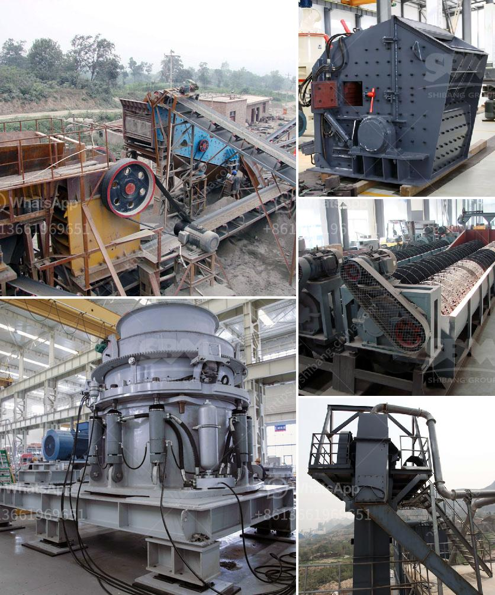

<h3>used stone crusher ontario</h3>
When it comes to the construction industry, the importance of aggregate cannot be underestimated. Aggregate is the most essential material used in construction projects, ranging from roads, bridges, buildings, to even landscaping projects. To meet the growing demand for aggregate, there is a need for efficient and cost-effective crushing equipment. Used stone crushers provide a cost-effective solution for aggregate production in Ontario, Canada.

The stones that are sourced from the quarries and are processed to meet certain specifications are subjected to crushing operations. Crushing is an important step in the production of aggregate as it reduces the size of the stones to be used for various purposes. The most common types of crushers used in the industry are jaw crushers, cone crushers, impact crushers, and gyratory crushers.

One of the key benefits of used stone crusher Ontario is the lower cost. It is when compared to new crushing equipment. Buying a new crusher might be expensive, and cost-prohibitive for many companies. However, by purchasing a used crusher, companies can significantly reduce their initial investment and still acquire a reliable crushing equipment.

Moreover, used stone crushers offer excellent performance and durability. They are designed to withstand heavy and continuous use, and can process different types of stones efficiently. Whether it is granite, limestone, concrete, or any other material, a used stone crusher can handle them all. Its robust design and high-quality steel construction ensure that the crusher can withstand the toughest conditions, without compromising its performance.

Another advantage of used stone crushers is the availability of spare parts. With new equipment, there might be a waiting period for spare parts to be imported or manufactured. However, since used stone crushers have been in operation for some time, there is a good chance that spare parts are readily available in the market. This means that even if there is a breakdown, the downtime can be minimized as the spare parts can be quickly sourced and installed.

Used stone crushers in Ontario are also environmentally friendly. By recycling construction waste and reusing stones, the need for new quarries and the extraction of raw materials can be significantly reduced. This helps in conserving natural resources and minimizing the impact on the environment.

To conclude, used stone crushers in Ontario provide a cost-effective solution for aggregate production. With lower initial investment, excellent performance, and the availability of spare parts, these crushers can significantly benefit companies involved in construction projects. Furthermore, their environmental friendliness makes them a responsible choice for sustainable development. So, if you are in need of crushing equipment for your aggregate production needs, consider purchasing a used stone crusher Ontario.
<h3>Contact us</h3><ul><li><strong>Whatsapp:&nbsp;<a href="https://wa.me/8613661969651">+8613661969651</a></strong></li><li><a href="https://swt.shibang-china.com/?git&amp;zhl&amp;used stone crusher ontario"><strong>Online Service(chat now)</strong></a></li></ul><h3>Related</h3><ul><li><a href='mobile crusher morocco price.md'>mobile crusher morocco price</a></li><li><a href='200tph vsi crushers.md'>200tph vsi crushers</a></li><li><a href='design design your alluvial mining plant.md'>design design your alluvial mining plant</a></li><li><a href='crusher equipment in sweden.md'>crusher equipment in sweden</a></li><li><a href='mtm trapezium grinder mill.md'>mtm trapezium grinder mill</a></li></ul>