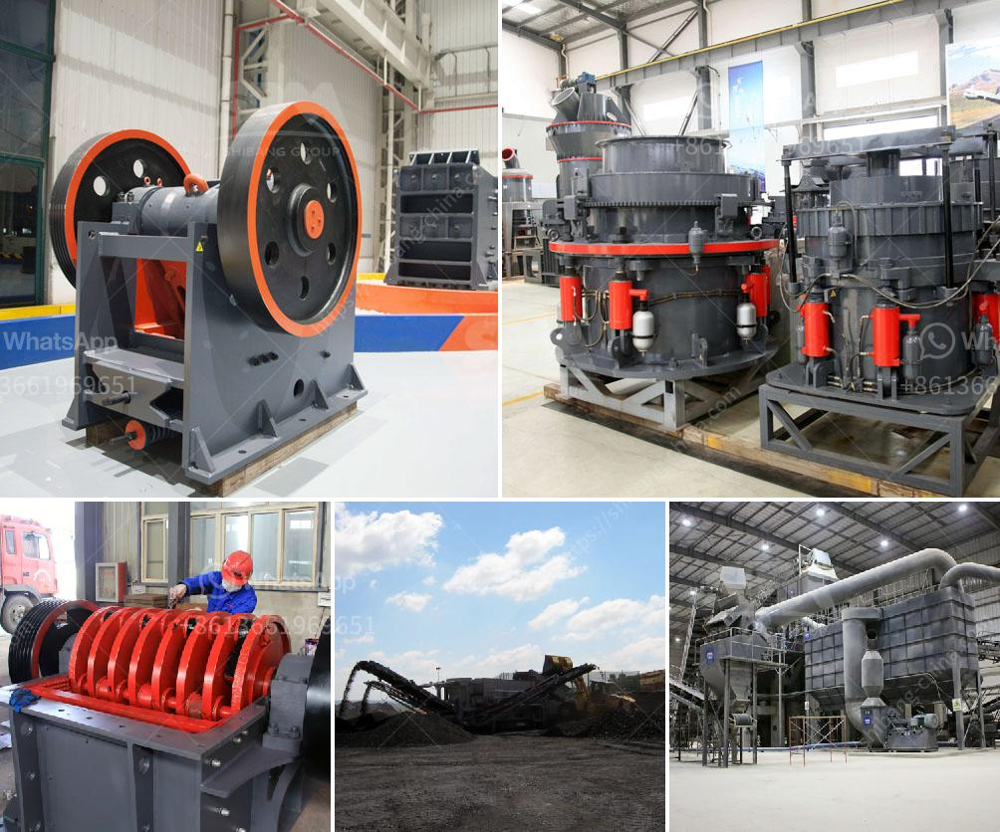

<h3>used stone crushers for ballast sale</h3>
Stone crushing industry is a large scale industry with high productivity and economy. There are several types of stone crushers for sale in ballast crushing plants. Jaw crusher is used as primary crusher machine, when big stones are crushed smaller by the jaw crusher; they are transferred to impact crusher or cone crusher for secondary or tertiary crushing, then go through the stone shaping machine for getting cubic size. With several types of crushers available for sale, it is important to choose the right one for your needs.

One of the most commonly used stone crushers for ballast is impact crusher. Impact crushers are used to break down and reduce the size of stones. They have a rotor with rotating hammers that throw the stones against hard surfaces, causing them to break into smaller sizes. This type of crusher is ideal for crushing brittle materials such as limestone, granite, and concrete.

Cone crushers are another type of stone crusher commonly used in ballast crushing plants. These crushers have a cone-shaped crushing chamber that opens at the top and closes at the bottom. The cone-shaped crushing chamber is lined with replaceable manganese steel liners. As the cone crusher moves closer to the concave, the stones are crushed between the mantle and the concave, and the crushed stones fall out through the bottom opening.

Jaw crushers are also commonly used for ballast crushing. These crushers have a fixed jaw and a moving jaw. The moving jaw moves back and forth against the fixed jaw, crushing the stones between them. Jaw crushers are ideal for primary crushing applications, as they can handle large stones up to 1.5m in diameter.

When choosing a stone crusher for ballast crushing, it is important to consider the output and quality of the final product. The size and shape of the stones are important factors to consider. The size of the stones can range from small pebbles to larger boulders. The shape of the stones can be cubic, round, or irregular. The final product should be of a consistent size and shape for proper ballast function.

There are many used stone crushers available for sale, each with different specifications and capabilities. It is important to thoroughly research and evaluate each crusher to ensure it meets your specific needs. Some of the factors to consider when choosing a crusher include the capacity, power consumption, and maintenance requirements.

In conclusion, the sale of used stone crushers for ballast is a good choice for both individual users and stone crushing companies. The crushers have a wide range of applications and are suitable for crushing various types of stones with different hardness levels. With the right crusher, you can get the desired size and shape of stones for ballast use. So, take your time to research and choose the best crusher for your needs.
<h3>Contact us</h3><ul><li><strong>Whatsapp:&nbsp;<a href="https://wa.me/8613661969651">+8613661969651</a></strong></li><li><a href="https://swt.shibang-china.com/?git&amp;zhl&amp;used stone crushers for ballast sale"><strong>Online Service(chat now)</strong></a></li></ul><h3>Related</h3><ul><li><a href='sand business plan.md'>sand business plan</a></li><li><a href='for sale stone crusher in sri lanka.md'>for sale stone crusher in sri lanka</a></li><li><a href='china granite crusher.md'>china granite crusher</a></li><li><a href='coal washing plant cost.md'>coal washing plant cost</a></li><li><a href='rumus perhitungan kapasitas jaw crusher.md'>rumus perhitungan kapasitas jaw crusher</a></li></ul>