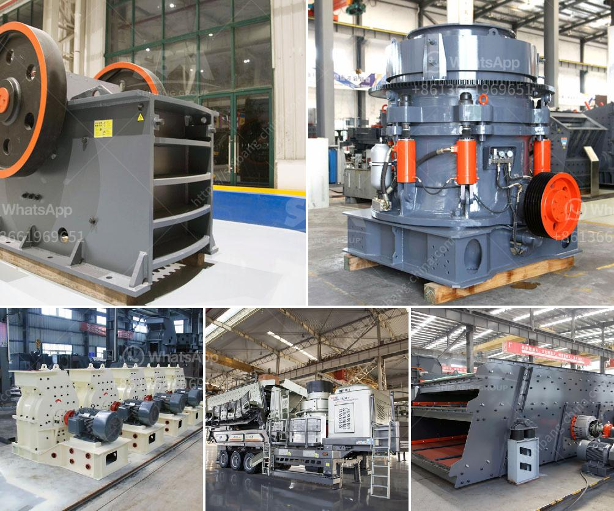

<h3>used stone crushers for sale germany</h3>
Germany has a rich heritage of mining, mineral extraction, and quarrying activities. With a strong industrial base and a wide range of technological advancements, the country has always been a leading market for used stone crushers worldwide. From large primary crushers to smaller secondary and tertiary units, purchasing used stone crushers in Germany can provide a cost-effective solution for many industries.

Stone crushers are used to break down rocks and stones into smaller pieces. They are commonly used in quarries, mining operations, construction sites, and recycling applications. With the ever-increasing demand for crushed materials, the market for used stone crushers in Germany is thriving.

One of the key reasons behind the popularity of used stone crushers in Germany is their relatively low price compared to newer models. This factor makes them an attractive choice for budget-conscious businesses or individuals who need reliable crushing equipment without breaking the bank. Owing to the well-established market for used crushers, finding a suitable machine within a specific budget range is relatively easy in Germany.

Used stone crushers in Germany are also known for their high resale value. This means that even if you decide to change your machine after a couple of years or if you wish to resell it in the market, its resale value will remain consistent. This value addition makes used stone crushers highly attractive in the used market.

Another advantage of purchasing used stone crushers is their low operating costs. The machines are highly fuel-efficient and consume less energy compared to newer models. This not only saves on operating costs but also minimizes the environmental impact associated with energy consumption.

Additionally, used stone crushing equipment in Germany allows you to take advantage of a wider selection of machinery, as they are generally more readily available compared to new equipment. This provides businesses with a greater range of options to choose from, allowing them to find the perfect machine for their specific needs and requirements.

When purchasing used stone crushers in Germany, it is important to ensure that the machine is in good condition and has been maintained properly. Regular inspections, maintenance records, and documentation of any repairs performed on the equipment should be obtained to ensure its reliability and performance.

In conclusion, used stone crushers in Germany offer an array of benefits to businesses and individuals alike. Their affordable price, high resale value, low operating costs, and wide availability make them a popular choice in the crushing industry. Germany's strong industrial reputation coupled with its technological advancements makes it a thriving market for used stone crushers. Whether you are in the quarrying, mining, construction, or recycling industry, purchasing a used stone crusher in Germany can provide an efficient and cost-effective solution to meet your crushing needs.
<h3>Contact us</h3><ul><li><strong>Whatsapp:&nbsp;<a href="https://wa.me/8613661969651">+8613661969651</a></strong></li><li><a href="https://swt.shibang-china.com/?git&amp;zhl&amp;used stone crushers for sale germany"><strong>Online Service(chat now)</strong></a></li></ul><h3>Related</h3><ul><li><a href='for a new stone quarry crusher in uganda.md'>for a new stone quarry crusher in uganda</a></li><li><a href='used ballast crusher in uk.md'>used ballast crusher in uk</a></li><li><a href='brand new cone crusher for sale india.md'>brand new cone crusher for sale india</a></li><li><a href='rock crusher in ghana.md'>rock crusher in ghana</a></li><li><a href='harga mesin sekunder stone crusher bekas.md'>harga mesin sekunder stone crusher bekas</a></li></ul>