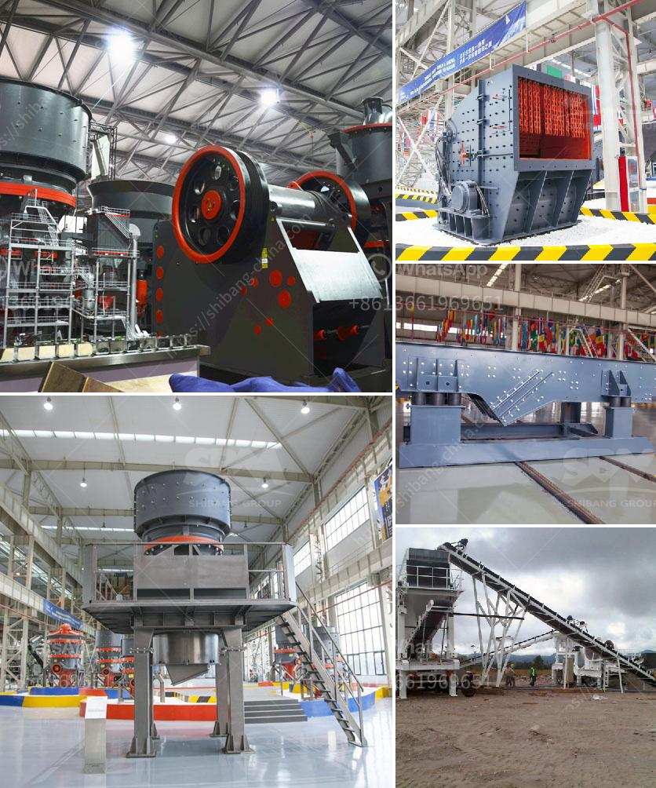

<h3>used stone crushers for sale in accra</h3>
Are you in need of a reliable and efficient solution for crushing stones in Accra? If so, then look no further than the range of used stone crushers for sale in Accra. These machines are designed to crush stones of various sizes and hardness levels, ensuring that you can find the perfect crusher for your specific needs.

When it comes to crushing stones, efficiency is key. That is why the used stone crushers available in Accra are equipped with advanced features and cutting-edge technology to ensure maximum productivity. These crushers are capable of crushing large quantities of stones in a short period, allowing you to meet deadlines and complete projects on time.

One of the primary advantages of purchasing a used stone crusher in Accra is affordability. These machines are often available at a fraction of the cost of a new crusher, making them an ideal choice for businesses operating on a tight budget. Despite being pre-owned, these crushers are in excellent condition and have been thoroughly inspected to ensure their performance and reliability.

In Accra, you can find a wide range of used stone crushers for sale. From jaw crushers to cone crushers and impact crushers, each crusher type is designed to meet specific crushing requirements. With different features and capabilities, it is important to choose the right crusher for your needs.

For instance, if you need to crush large stones into smaller particles, a jaw crusher would be a suitable choice. These crushers have a fixed jaw and a movable jaw that moves back and forth to crush the stones against a fixed plate. Jaw crushers are known for their high production rates and reliability.

On the other hand, if you require finely crushed stones for road construction or concrete production, a cone crusher would be ideal. These crushers have a cone-shaped crushing chamber that gyrates around its axis to give a compression crushing action. Cone crushers are particularly effective for fine and medium crushing.

For applications where a high degree of impact is required, such as in mining or quarrying, an impact crusher is the right choice. These crushers use a high-speed rotor and anvils to create impact and break stones into smaller pieces. With their ability to handle abrasive materials, impact crushers are particularly suited for crushing hard stones.

No matter which type of used stone crusher you choose in Accra, you can be confident in its ability to deliver consistent and reliable performance. These machines are made to withstand the toughest conditions and are built to last. Additionally, with authorized dealers and service centers available in Accra, you can receive professional assistance and support throughout the lifetime of your crusher.

In conclusion, if you are in need of a cost-effective and efficient solution for crushing stones in Accra, consider purchasing a used stone crusher. With various types and models available, you can find the right crusher to meet your specific needs. Take advantage of the affordability and reliability offered by these pre-owned crushers and ensure the success of your projects.
<h3>Contact us</h3><ul><li><strong>Whatsapp:&nbsp;<a href="https://wa.me/8613661969651">+8613661969651</a></strong></li><li><a href="https://swt.shibang-china.com/?git&amp;zhl&amp;used stone crushers for sale in accra"><strong>Online Service(chat now)</strong></a></li></ul><h3>Related</h3><ul><li><a href='pf trituradora de impacto.md'>pf trituradora de impacto</a></li><li><a href='layout design for stone crushing plant.md'>layout design for stone crushing plant</a></li><li><a href='silica sand ball mill.md'>silica sand ball mill</a></li><li><a href='jaw crushers machine for sale.md'>jaw crushers machine for sale</a></li><li><a href='feldspar ball mill in kenya.md'>feldspar ball mill in kenya</a></li></ul>