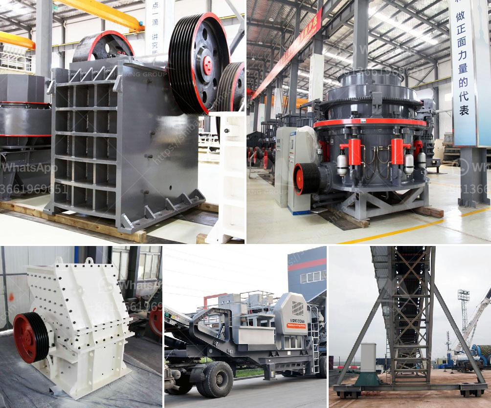

<h3>vermiculite processing equipment</h3>
Vermiculite, a natural mineral that expands when heated, is a versatile material used in a wide range of industrial and commercial applications. Its unique properties make it an excellent choice for insulation, fireproofing, and gardening applications. To meet the growing demand for high-quality vermiculite products, manufacturers rely on advanced vermiculite processing equipment.

Vermiculite processing equipment plays a crucial role in extracting and refining raw vermiculite ore into a wide range of useful products. This equipment not only ensures efficient processing but also maintains the purity and integrity of the vermiculite.

One of the primary steps in vermiculite processing is mining. Vermiculite deposits are often found in open-pit mines where the ore is extracted using conventional mining techniques. The ore is then transported to a processing plant, where it undergoes various stages of crushing, screening, and grinding.

In the crushing stage, specialized crushers are used to break down the large chunks of vermiculite ore into smaller pieces. This facilitates easier handling, transportation, and subsequent processing. The crushed ore is then further processed through a series of screens to separate it into different grain sizes.

Once the desired particle sizes are achieved, the vermiculite undergoes a grinding process. Grinding mills, equipped with specific grinding media, are used to reduce the ore to an appropriate fineness suitable for further processing. This step helps increase the surface area of the vermiculite, facilitating better absorption and enhancing its overall performance in various applications.

After grinding, the vermiculite is often subjected to a process called classification. This involves separating the vermiculite particles into different grades based on size. Classifiers, which use the principle of gravity and airflow, are commonly employed for this purpose. The classified vermiculite is then collected and stored in silos for further use.

Another critical aspect of vermiculite processing is the removal of any impurities or unwanted minerals. Various techniques, such as froth flotation, magnetic separation, and gravity separation, are employed to achieve this. These separation methods utilize specific physical and chemical properties, allowing the selective removal of impurities while retaining the valuable vermiculite particles.

In recent years, advanced vermiculite processing equipment has been developed to enhance efficiency and product quality. This includes the use of automated systems, sophisticated control mechanisms, and state-of-the-art sensors. These technological advancements allow manufacturers to optimize their processing operations, reduce energy consumption, and improve overall productivity.

Furthermore, modern vermiculite processing equipment incorporates safety features to protect workers and the environment. Dust collection systems help minimize the release of airborne particles during the various processing stages, ensuring a safe working environment. Additionally, waste management systems efficiently handle the disposal of waste materials generated during the processing operations.

In conclusion, vermiculite processing equipment is essential for the efficient extraction and refinement of vermiculite ore. The equipment's advanced capabilities enable manufacturers to produce high-quality vermiculite products that meet the stringent requirements of diverse industries. With continuous advancements in technology, the processing equipment's efficiency, safety features, and environmental sustainability will likely continue to improve, allowing manufacturers to meet the growing demand for this versatile mineral.
<h3>Contact us</h3><ul><li><strong>Whatsapp:&nbsp;<a href="https://wa.me/8613661969651">+8613661969651</a></strong></li><li><a href="https://swt.shibang-china.com/?git&amp;zhl&amp;vermiculite processing equipment"><strong>Online Service(chat now)</strong></a></li></ul><h3>Related</h3><ul><li><a href='stone jaw crusher for rock crushing.md'>stone jaw crusher for rock crushing</a></li><li><a href='quote for stone crusher.md'>quote for stone crusher</a></li><li><a href='crusher machine price in kenya.md'>crusher machine price in kenya</a></li><li><a href='used concrete crushers uk.md'>used concrete crushers uk</a></li><li><a href='quarry equipment for sale brisbane.md'>quarry equipment for sale brisbane</a></li></ul>