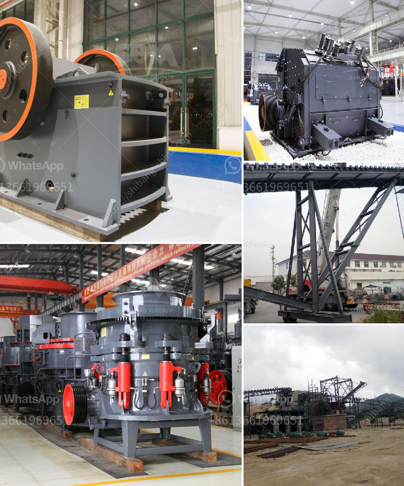

<h3>vertical cement mill grinding plant</h3>
equipment in the cement production line, it has a strong adaptability to various materials, such as raw coal, slag, cement

The grinding process in a vertical cement mill is accomplished by two types of grinding methods: dry grinding and wet grinding. The wet grinding is more commonly used because it uses a lower energy consumption and produces a better quality cement product compared to the dry grinding process.

In the vertical cement mill grinding process, the grinding table is the most important part of the equipment. It is used to support the material being ground and move it forward as it is being pulverized. The grinding table also plays a significant role in grinding efficiency and production capacity. The design and material of the grinding table need to be considered carefully to ensure the smooth operation of the vertical cement mill.

In addition to the grinding table, other important components of the vertical cement mill include the grinding roller and grinding disc. These components work together to crush and grind the raw materials into the desired fineness. A proper combination of these components can optimize the grinding efficiency and reduce energy consumption.

Vertical cement mill grinding plant has a great market prospect in the future. With the enhancement of environmental awareness and the improvement of construction quality, the demand for cement products is increasing. The vertical cement mill grinding plant will become an important part of the cement industry.

The introduction of vertical cement mill grinding plant eliminates the shortcomings of the traditional mill grinding system. Nowadays, vertical cement mills are capable of grinding a variety of raw materials, clinker, and cement, slag, and coal. This versatility is beneficial for both the cement industry and the environment.

Vertical cement mill grinding plant plays an important role in the construction industry and provides the raw materials needed for infrastructure development. With the development of construction industry, the demand for cement products continues to increase. Therefore, the vertical cement mill grinding plant will continue to play an important role in cement production, and its low energy consumption and high production efficiency will be beneficial to both the cement industry and the environment.
<h3>Contact us</h3><ul><li><strong>Whatsapp:&nbsp;<a href="https://wa.me/8613661969651">+8613661969651</a></strong></li><li><a href="https://swt.shibang-china.com/?git&amp;zhl&amp;vertical cement mill grinding plant"><strong>Online Service(chat now)</strong></a></li></ul><h3>Related</h3><ul><li><a href='cost of bentonite manufacturing processing plant.md'>cost of bentonite manufacturing processing plant</a></li><li><a href='rock crusher machine for sale philippines.md'>rock crusher machine for sale philippines</a></li><li><a href='efficiency energetic efficiency of roller mill.md'>efficiency energetic efficiency of roller mill</a></li><li><a href='mining mobile crusher and washing lebanon.md'>mining mobile crusher and washing lebanon</a></li><li><a href='impact crusher seller.md'>impact crusher seller</a></li></ul>