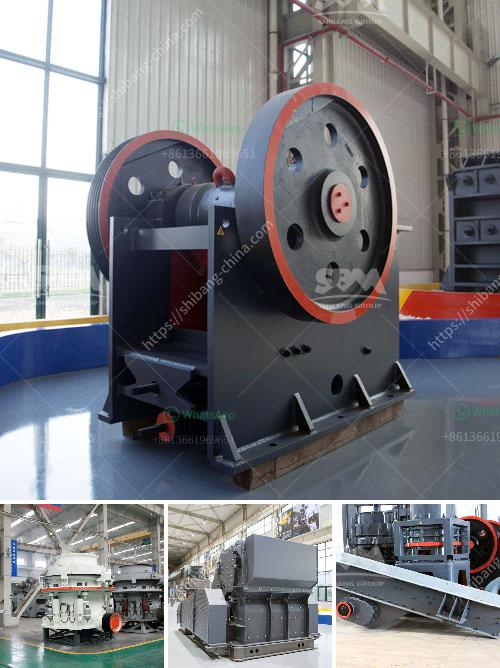

<h3>vertical mill manufacturers</h3>
Vertical mill manufacturers play a crucial role in the manufacturing industry, as they provide the equipment needed to produce high-quality products efficiently and effectively. These manufacturers specialize in the design, development, and production of vertical mills, which are commonly used in industries such as mining, construction, and metalworking.

One of the leading vertical mill manufacturers is XYZ Company. With decades of experience in the industry, XYZ Company has established itself as a reputable manufacturer known for its innovative solutions and superior-quality products. The company's vertical mills are highly versatile and can be used for a wide range of applications, making them a popular choice among manufacturers worldwide.

XYZ Company's vertical mills are renowned for their durability and precision. The company takes great pride in its engineering capabilities, which enable them to produce mills that can withstand heavy-duty operations with ease. The high-quality materials used in the construction of these mills ensure their longevity and performance, making them a long-term investment for manufacturers.

In addition to the durability and precision of their vertical mills, XYZ Company also focuses on providing user-friendly features and functionalities. Their mills are designed with the operator in mind, with intuitive control panels and easy-to-understand interfaces. This ensures that manufacturers can operate the mills efficiently, minimizing downtime and maximizing productivity.

Another notable vertical mill manufacturer is ABC Industries. This company has built a solid reputation for manufacturing mills that deliver exceptional performance and efficiency. ABC Industries utilizes cutting-edge technology and state-of-the-art machinery to produce mills that meet the highest industry standards.

ABC Industries' vertical mills are known for their versatility and adaptability. The company offers a wide range of customization options, allowing manufacturers to tailor the mills to their specific needs and requirements. Whether it's a specific size, capacity, or specialized features, ABC Industries can deliver mills that cater to the unique demands of their customers.

Moreover, ABC Industries puts great emphasis on research and development, constantly pushing the boundaries of innovation in vertical mill manufacturing. The company invests in advanced technologies and collaborates with industry experts to develop mills that incorporate the latest advancements. This commitment to innovation ensures that manufacturers can stay ahead of the competition and continually improve their production processes.

In conclusion, vertical mill manufacturers play a crucial role in the manufacturing industry by providing high-quality and efficient equipment. Companies like XYZ Company and ABC Industries have established themselves as leaders in the industry, offering durable, precise, and user-friendly vertical mills. Their commitment to innovation and customer satisfaction has made them go-to choices for manufacturers looking to enhance their productivity and achieve exceptional results.
<h3>Contact us</h3><ul><li><strong>Whatsapp:&nbsp;<a href="https://wa.me/8613661969651">+8613661969651</a></strong></li><li><a href="https://swt.shibang-china.com/?git&amp;zhl&amp;vertical mill manufacturers"><strong>Online Service(chat now)</strong></a></li></ul><h3>Related</h3><ul><li><a href='talc commodity processing facility companies.md'>talc commodity processing facility companies</a></li><li><a href='vibrating screens pictures.md'>vibrating screens pictures</a></li><li><a href='impact crusher seller.md'>impact crusher seller</a></li><li><a href='used sand wash plant for sale in texas.md'>used sand wash plant for sale in texas</a></li><li><a href='how to grind stone into fine powder.md'>how to grind stone into fine powder</a></li></ul>