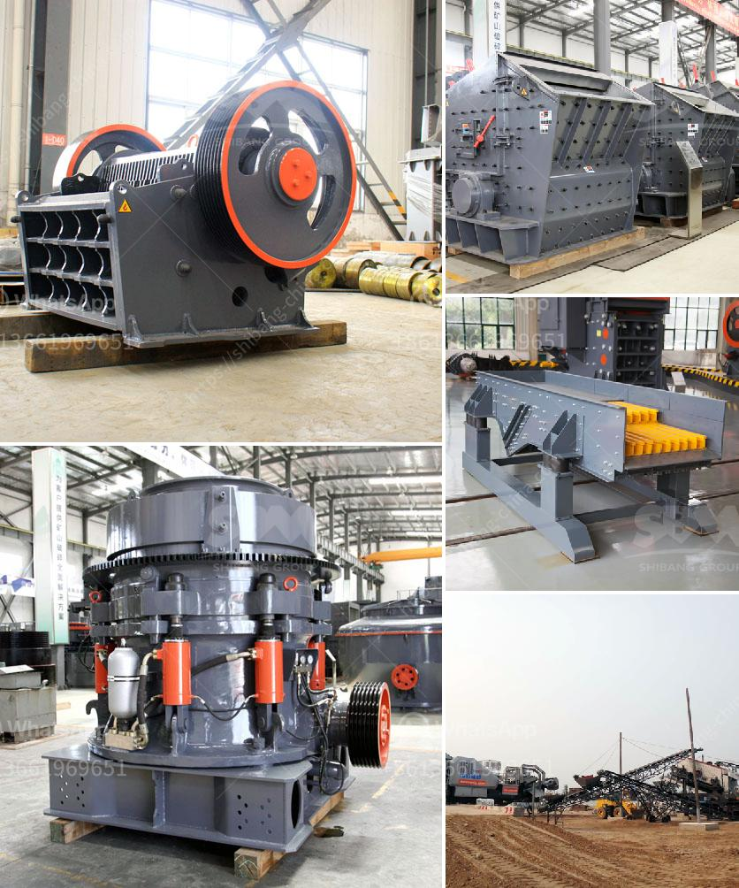

<h3>vertical mill price</h3>
When it comes to the manufacturing industry, a vertical mill is a crucial piece of machinery. It is used for machining various materials and creating finely finished products. However, before investing in a vertical mill, it is essential to consider the price and ensure that it aligns with your budget and requirements.

The price of a vertical mill can vary significantly depending on several factors. One primary factor is the brand and reputation of the manufacturer. Established and reputable brands may offer higher prices due to their superior quality and reliability. However, lesser-known brands may provide a more affordable option without compromising on performance.

Another crucial factor to consider is the size and capacity of the mill. Vertical mills come in various sizes to accommodate different machining needs. Larger mills often come with higher price tags due to their increased capacity and capability to handle more substantial materials. It is crucial to assess your manufacturing requirements and choose a mill that fits your specific needs without overspending.

Additionally, the features and functionalities of the vertical mill can affect its price. Mills with advanced features, such as digital controls, automatic feed systems, and multiple axis capabilities, tend to be more expensive. These added features can significantly enhance productivity and efficiency, but they may not be necessary for every application. Hence, it is essential to evaluate your machining needs and determine if the extra cost for advanced features is justified.

Lastly, it is crucial to compare prices from different suppliers and consider the after-sales services they offer. Some suppliers may include installation, training, and maintenance services in the final price, while others may charge separately for these services. Considering the overall package, including the cost of essential services, can help you make an informed decision and ensure the best value for your investment.

In conclusion, the price of a vertical mill is influenced by various factors such as brand reputation, size and capacity, features and functionalities, and after-sales services. It is crucial to assess your manufacturing needs and budget before making a purchase. Comparison shopping and weighing the benefits of different options will help you find a vertical mill that meets your requirements without breaking the bank.
<h3>Contact us</h3><ul><li><strong>Whatsapp:&nbsp;<a href="https://wa.me/8613661969651">+8613661969651</a></strong></li><li><a href="https://swt.shibang-china.com/?git&amp;zhl&amp;vertical mill price"><strong>Online Service(chat now)</strong></a></li></ul><h3>Related</h3><ul><li><a href='iron ore crushing plant in germany.md'>iron ore crushing plant in germany</a></li><li><a href='harga pe jc jaw crusher dan harga.md'>harga pe jc jaw crusher dan harga</a></li><li><a href='granite crusher machines.md'>granite crusher machines</a></li><li><a href='limestone ball mill machine.md'>limestone ball mill machine</a></li><li><a href='how much capital needed to start a midium cement factory.md'>how much capital needed to start a midium cement factory</a></li></ul>