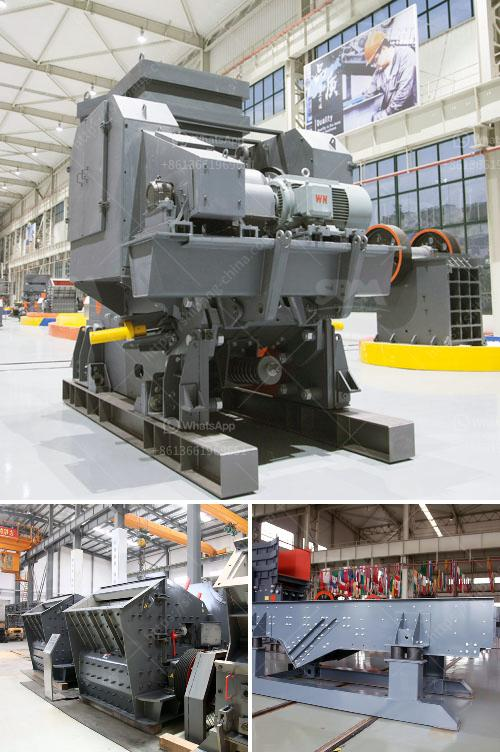

<h3>vertical mill size distribution</h3>
Vertical mills are widely used in various industrial sectors for grinding raw materials into fine powders. In order to maximize their operational efficiency and ensure desired product quality, it is crucial to carefully control the size distribution of particles that are generated during the grinding process. This article explores the significance of vertical mill size distribution and its impact on overall milling performance.

Achieving the desired size distribution plays a vital role in optimizing the grinding efficiency of a vertical mill. The size distribution refers to the range of particle sizes present in the ground material. An ideal size distribution ensures that the particles are evenly distributed, facilitating uniform grinding and reducing excessive energy consumption.

Controlling the size distribution is essential for the production of high-quality products. In industries such as cement or mining, the desired product characteristics, such as fineness or specific surface area, are directly influenced by the particle size distribution. Improper size distribution can lead to undesired variations in product quality, resulting in increased waste and reduced overall plant productivity.

Size distribution significantly affects the energy consumption of a vertical mill. When the feed material contains a narrow particle size range, the mill can operate at a lower energy consumption due to reduced internal circulation and transportation of oversized particles. Conversely, a broader size distribution increases the energy demand, leading to higher operational costs.

To achieve an optimal size distribution, various strategies can be implemented. Careful selection of mill internals, such as grinding media and liners, along with proper mill operating parameters, can help control the particle size distribution. Additionally, advanced process control systems provide real-time monitoring and adjustment capabilities to maintain the desired size distribution, contributing to improved grinding efficiency.

The size distribution of particles in a vertical mill is a critical parameter that affects grinding efficiency, energy consumption, and product quality. Industries must focus on optimizing the size distribution by employing appropriate mill internals and process control strategies. By doing so, they can enhance operational performance, reduce costs, and ensure the production of high-quality products.
<h3>Contact us</h3><ul><li><strong>Whatsapp:&nbsp;<a href="https://wa.me/8613661969651">+8613661969651</a></strong></li><li><a href="https://swt.shibang-china.com/?git&amp;zhl&amp;vertical mill size distribution"><strong>Online Service(chat now)</strong></a></li></ul><h3>Related</h3><ul><li><a href='manganese ore washing plant and crusher in zambia.md'>manganese ore washing plant and crusher in zambia</a></li><li><a href='crusher price sayaji.md'>crusher price sayaji</a></li><li><a href='second hand mobile crushers and screens south africa.md'>second hand mobile crushers and screens south africa</a></li><li><a href='calcium carbonate plant layout diagram.md'>calcium carbonate plant layout diagram</a></li><li><a href='marble crusher machines usa.md'>marble crusher machines usa</a></li></ul>