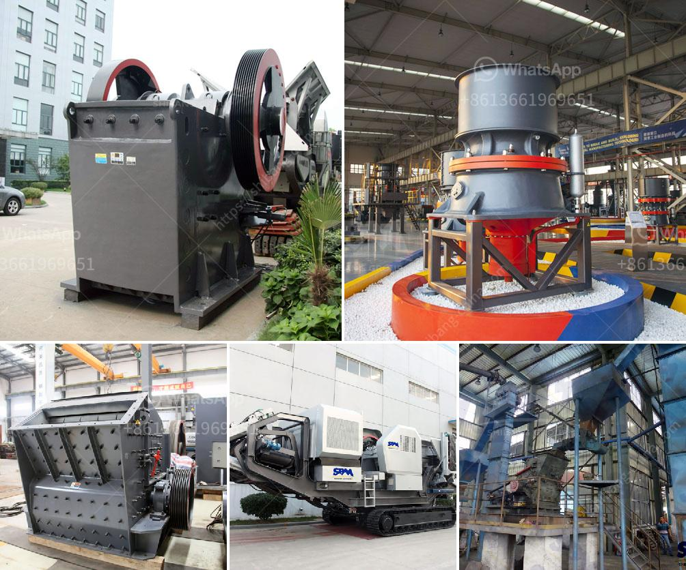

<h3>vertical raw mill industry</h3>
Vertical raw mill is a type of industrial equipment used to crush or grind materials into small particles. This machine consists of a driven motor, which drives the grinding table and pressure plates. The raw material is fed into the mill through the center or side of the grinding table. As the table rotates, the material is crushed under the pressure plates and grinded into fine particles.

The vertical raw mill industry plays a vital role in various sectors, such as cement production, power generation, mining, and metallurgy. It offers efficient and reliable grinding solutions for diverse raw materials, including limestone, clay, iron ore, and coal. The processed materials can be used as fuel or additives in the production of cement and other building materials.

One of the significant advantages of vertical raw mill is its ability to dry and grind materials simultaneously. This eliminates the need for additional drying equipment, resulting in cost savings and increased production efficiency. Furthermore, the vertical raw mill can be easily integrated into existing processing plants, making it a preferred choice for plant upgrades and expansions.

In recent years, the vertical raw mill industry has witnessed significant advancements in technology and design. Manufacturers are continuously improving the performance and energy efficiency of these machines, resulting in reduced power consumption and environmental impact. Additionally, automation and digitalization have revolutionized the operational capabilities of vertical raw mills, enabling remote monitoring, diagnostics, and optimization.

However, challenges such as high initial investment and maintenance costs remain in the vertical raw mill industry. Manufacturers are continuously working to address these issues and improve the overall performance and cost-effectiveness of their machines.

In conclusion, the vertical raw mill industry plays a crucial role in the processing of raw materials for various industries. With advancements in technology and design, these machines offer efficient and reliable solutions for grinding and drying raw materials. Despite challenges, manufacturers continue to innovate, making vertical raw mills an indispensable part of modern industrial operations.
<h3>Contact us</h3><ul><li><strong>Whatsapp:&nbsp;<a href="https://wa.me/8613661969651">+8613661969651</a></strong></li><li><a href="https://swt.shibang-china.com/?git&amp;zhl&amp;vertical raw mill industry"><strong>Online Service(chat now)</strong></a></li></ul><h3>Related</h3><ul><li><a href='design calculation of jaw crusher pdf.md'>design calculation of jaw crusher pdf</a></li><li><a href='calculation of owning and operating costs of crushers.md'>calculation of owning and operating costs of crushers</a></li><li><a href='used portable stone crushers for sale ontario.md'>used portable stone crushers for sale ontario</a></li><li><a href='power calculation hammer mill equation.md'>power calculation hammer mill equation</a></li><li><a href='dedusting systems for crushers.md'>dedusting systems for crushers</a></li></ul>