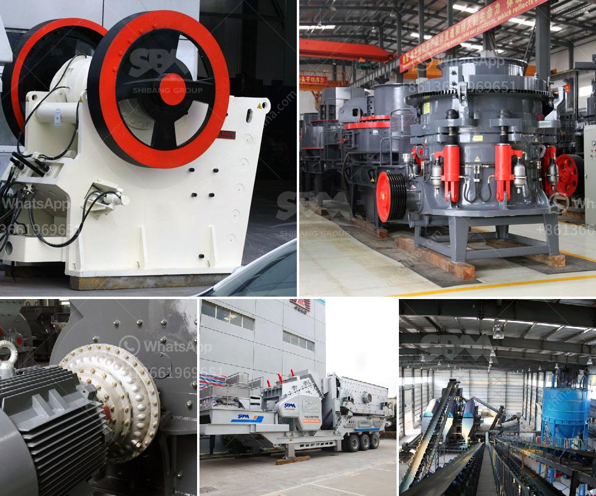

<h3>vertical roll mill</h3>
Vertical roller mill is a type of grinder used to grind materials into extremely fine powder for use in mineral dressing processes, paints, pyrotechnics, cements and ceramics. It is an energy efficient alternative for a ball mill.

Vertical roller mill has many different forms, but it works basically the same. All of these forms of machine come with a roller (or the equivalent of roller grinding parts), and roller along the track of the disc at the level of circular movement imposed by external grinding roller in the vertical pressure on the disc on the material being the joint action of compression and shear, and to crush.

Vertical roller mill is a kind of grinding machine for cement, raw material, cement clinker, slag and coal slag. It has the features of simple structure and low cost of manufacture and use. Vertical roller mill has many different forms, but it works basically the same. All of these forms of machine come with a roller (or the equivalent of roller grinding parts), and roller along the track of the disc at the level of circular movement imposed by external grinding roller in the vertical pressure on the disc on the material being the joint action of compression and shear, and to crush.

Raw materials: iron ore, coal powder, coke powder, coal gangue, fly ash, volcanic ash, gypsum, calcite, pyrophyllite, quartz, clay, sandstone, bauxite and other processing industry related to metal and non-metal mine.

The grinding disc is driving by motor through reducer. The material falls to grinding disc from the feed opening. The materials are driven to the edge of disc by the centrifugal force and crushed into fine powders by rollers. Then, the hot air from the nozzle take the fine powder to high effiency classsifer.

The qualified powder are taken by the air to the powder collector to be collected, while the unqualified powder are sent back for regrinding.

1. High grinding efficiency: save 20~30% power consumption compared with the ball mill. With the increasing of moisture content, it can save more and more electricity.

4. Low noises and little dust: no direct contact between the grinding rollers and grinding disc, so metallic impact is avoided and its noises is 20~25 decibels lower. Totally closed negative pressure operation has employed by this vertical raw mill, so there is little dust during the operation, which effectively reduces dust pollution.

5. Strong drying capacity: it can make use of the hot waste gases from the kiln to do drying, and it is capable of drying and grinding raw materials with moisture content as much as 15%.

6. Easy operation: due to structure is simple, less machine quantity, also highly improved techniques, reduced energy consumption, also easy to disassembly and maintain.

7. Environmental protection: preheating system integrated with air pollution control equipment makes the entire coal mill plant be safely and fully put into operation, and achieve the maximum economic benefits with minimum investment.

Overall, vertical roller mill for cement grinding is a promising and cost-effective solution. Long-term energy savings, low maintenance costs, and shorter downtime periods are some of the benefits of this mill. However, the process requires more power than a conventional ball mill, which reduces the overall efficiency.
<h3>Contact us</h3><ul><li><strong>Whatsapp:&nbsp;<a href="https://wa.me/8613661969651">+8613661969651</a></strong></li><li><a href="https://swt.shibang-china.com/?git&amp;zhl&amp;vertical roll mill"><strong>Online Service(chat now)</strong></a></li></ul><h3>Related</h3><ul><li><a href='machinery for talc manufacturing.md'>machinery for talc manufacturing</a></li><li><a href='rock crusher production screen mesh.md'>rock crusher production screen mesh</a></li><li><a href='control plan for ball mill manufacturing.md'>control plan for ball mill manufacturing</a></li><li><a href='lime dolomite plant in philippines.md'>lime dolomite plant in philippines</a></li><li><a href='talcum powder making machinery.md'>talcum powder making machinery</a></li></ul>