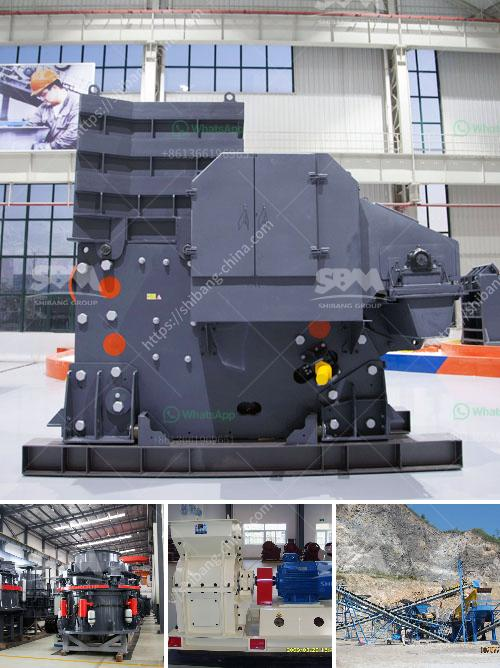

<h3>vertical roller mill in taiwan</h3>
Vertical roller mill (VRM) technology has gained momentum in the industrial mineral and cement industries in Taiwan. With several advancements made in technology over the years, VRM has become a popular choice for grinding raw materials and cement clinker due to its numerous benefits. This article will delve into the features and advantages of vertical roller mills, highlighting why it has become an essential equipment in the Taiwanese manufacturing industry.

First and foremost, a vertical roller mill is a highly efficient grinding machine that reduces raw materials, such as ore, coal, limestone, and cement clinker, into smaller particles. This mill operates under the principle of crushing, grinding, and drying simultaneously, minimizing energy consumption and maximizing grinding capacity. Its compact design allows for easy installation and maintenance, making it a cost-effective option for manufacturers in Taiwan.

One of the significant advantages of a vertical roller mill is its ability to handle different types of materials. With a variety of grinding rollers and grinding plates available, VRM can adapt to the requirements of various materials, ensuring optimal grinding efficiency. This versatility makes VRM suitable for a range of industries, including cement, power generation, metallurgy, and mining.

Another key benefit of VRM is its low noise level during operation. The mill's design minimizes noise generation compared to traditional ball mills or other grinding equipment, creating a more comfortable working environment for operators. Additionally, its enclosed system reduces dust emissions, enhancing workplace safety and meeting environmental regulations in Taiwan.

Vertical roller mills also offer improved particle size distribution control, resulting in better product quality and consistency. The adjustable separator speed and mill air flow ensure precise particle sizing and distribution, reducing oversize or undersize particles. This quality control feature is particularly crucial in the cement industry, where uniform particle sizes are essential for producing high-quality cement.

In terms of energy efficiency, vertical roller mills outperform traditional ball mills due to their higher grinding efficiency and lower power consumption. By utilizing the internal circulation system and optimizing the grinding process, VRM significantly reduces energy usage, leading to substantial cost savings for manufacturers in Taiwan. As energy costs continue to rise, this advantage becomes even more relevant, making VRM an attractive option for industries looking to improve their bottom line.

In conclusion, the vertical roller mill has become an integral part of Taiwan's industrial mineral and cement sectors. Its versatility, energy efficiency, noise reduction, and improved particle size distribution control make it an ideal choice for manufacturers. As technologies continue to advance, VRM is likely to witness further enhancements, solidifying its position as a crucial piece of equipment in the Taiwanese manufacturing industry.
<h3>Contact us</h3><ul><li><strong>Whatsapp:&nbsp;<a href="https://wa.me/8613661969651">+8613661969651</a></strong></li><li><a href="https://swt.shibang-china.com/?git&amp;zhl&amp;vertical roller mill in taiwan"><strong>Online Service(chat now)</strong></a></li></ul><h3>Related</h3><ul><li><a href='how much complete cost for iron ore crasher plants setup.md'>how much complete cost for iron ore crasher plants setup</a></li><li><a href='river sand suppliers in northern cape.md'>river sand suppliers in northern cape</a></li><li><a href='lime stone powder making machine in india.md'>lime stone powder making machine in india</a></li><li><a href='ton crushing machine.md'>ton crushing machine</a></li><li><a href='grinding balls in tanzania.md'>grinding balls in tanzania</a></li></ul>