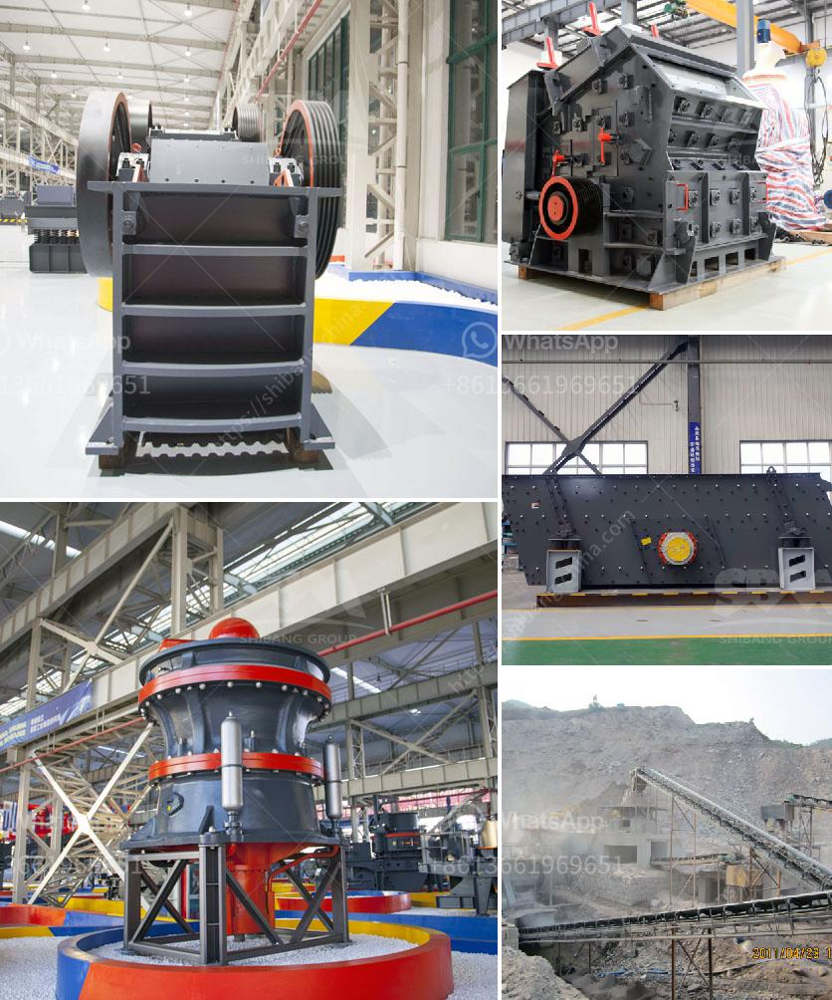

<h3>vertical roller mill manufacture in tamilnadu</h3>
Vertical roller mill (VRM) is a key equipment used for grinding materials in various industries such as cement, metallurgy, power plants, chemical and non-metallic minerals. It is widely used for grinding and ultra-fine grinding of different materials, such as limestone, gypsum, coal, cement clinker, blast furnace slag, and other non-metallic minerals. In Tamilnadu, there are several manufacturers of vertical roller mills that cater to the growing demands of the industry.

One of the reputed manufacturers of vertical roller mills in Tamilnadu is Bharath Industrial Works. Established in the year 1956, they have been offering innovative and high-quality products to their customers. The company has a state-of-the-art manufacturing facility equipped with advanced machinery and technology. They have a team of highly skilled engineers and technicians who ensure that the products manufactured adhere to international quality standards.

Bharath Industrial Works specializes in the fabrication and production of vertical roller mills of various capacities and sizes. They offer customized solutions to meet the specific requirements of their clients. The company is committed to providing cost-effective and efficient solutions to their customers without compromising on quality.

Vertical roller mills manufactured by Bharath Industrial Works have several advantages over traditional ball mills. They are designed to handle high capacity, high moisture, and high fineness materials. The grinding efficiency of VRMs is higher compared to ball mills, resulting in lower power consumption and improved productivity. The maintenance and operation costs are also lower compared to traditional mills, making VRMs an economical choice for industries.

The company also offers technical support and after-sales service to their customers. Their team of experts is available round the clock to assist in installation, commissioning, and maintenance of the vertical roller mills. They also provide training to the operators to optimize the performance of the mills.

Vertical roller mills manufactured by Bharath Industrial Works are not only used in Tamilnadu but also exported to various countries around the world. The company has built a strong reputation in the industry for delivering quality products and excellent customer service.

Apart from Bharath Industrial Works, there are several other manufacturers in Tamilnadu who are engaged in the production of vertical roller mills. These manufacturers have collectively contributed to the growth of the industry in the region. With increasing demands from various industries, vertical roller mills have become an essential equipment in the manufacturing process.

In conclusion, vertical roller mills are widely used in various industries in Tamilnadu, and there are several manufacturers catering to the growing demands of the industry. Bharath Industrial Works is one such reputed manufacturer offering high-quality and cost-effective solutions to their customers. With their state-of-the-art manufacturing facility and technical expertise, they have made a significant contribution to the industry. The growth of vertical roller mill manufacturing in Tamilnadu has positively impacted the overall industrial development in the region.
<h3>Contact us</h3><ul><li><strong>Whatsapp:&nbsp;<a href="https://wa.me/8613661969651">+8613661969651</a></strong></li><li><a href="https://swt.shibang-china.com/?git&amp;zhl&amp;vertical roller mill manufacture in tamilnadu"><strong>Online Service(chat now)</strong></a></li></ul><h3>Related</h3><ul><li><a href='limestone powder making machine india.md'>limestone powder making machine india</a></li><li><a href='suppliers of coveyor belting in durban.md'>suppliers of coveyor belting in durban</a></li><li><a href='limestone mines in ethiopia.md'>limestone mines in ethiopia</a></li><li><a href='kaolin mining crusher process.md'>kaolin mining crusher process</a></li><li><a href='cost of bentonite manufacturing processing plant.md'>cost of bentonite manufacturing processing plant</a></li></ul>