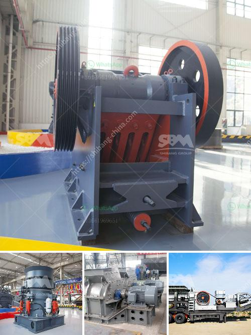

<h3>vertical roller mill</h3>
Vertical roller mill (VRM) is a type of industrial equipment used to crush or grind materials into small particles. It is widely used in the cement industry and plays a crucial role in improving the efficiency and quality of the final products.

The concept of vertical roller mill dates back to the early 1900s when German engineer Curt von Grueber developed the world's first vertical roller mill for grinding cement. His invention led to the modern VRM design that we know today. Since then, VRMs have become the preferred choice for grinding raw materials in the cement industry due to their numerous advantages.

One of the key benefits of VRMs is their energy efficiency. Compared to traditional ball mills, VRMs consume less energy and deliver higher grinding efficiency. This is primarily achieved through the use of vertical grinding rollers that exert pressure on the material being ground. The grinding rollers crush the raw materials between the roller and the grinding table, resulting in efficient comminution.

Another advantage of VRMs is their ability to handle a wide range of materials. Whether it is cement clinker, limestone, coal, or other minerals, VRMs can grind them with ease. This versatility makes VRMs an attractive choice for cement manufacturers, as it allows them to produce different types of cement and adapt to changing market demands.

In terms of maintenance and operation, VRMs are relatively easy to handle. They feature a modular design that facilitates quick and easy replacement of worn-out parts, minimizing downtime. Additionally, VRM control systems have advanced over the years, allowing operators to monitor and adjust the mill parameters in real-time, optimizing its performance.

Furthermore, VRMs offer improved product quality. Thanks to the precise control over grinding pressure, VRMs can produce particles of consistent size and shape. This results in a more uniform and high-quality final product, ensuring customer satisfaction.

However, it is important to note that there are some challenges associated with the use of a VRM. The main issue is the high initial investment cost. VRMs are relatively expensive compared to traditional ball mills. However, many cement manufacturers consider this as a long-term investment due to the operational and energy-saving benefits.

In conclusion, vertical roller mills have revolutionized the cement industry by offering numerous advantages over traditional grinding mills. Their energy efficiency, versatility, and ability to produce high-quality products have made them the preferred choice for cement manufacturers worldwide. Despite the initial investment cost, the long-term benefits of VRMs make them a worthwhile investment for any cement plant looking to enhance its grinding operations.
<h3>Contact us</h3><ul><li><strong>Whatsapp:&nbsp;<a href="https://wa.me/8613661969651">+8613661969651</a></strong></li><li><a href="https://swt.shibang-china.com/?git&amp;zhl&amp;vertical roller mill"><strong>Online Service(chat now)</strong></a></li></ul><h3>Related</h3><ul><li><a href='mobile stone crusher price ph.md'>mobile stone crusher price ph</a></li><li><a href='quarry crusher factors.md'>quarry crusher factors</a></li><li><a href='manufacturer of balls of ball mill in india.md'>manufacturer of balls of ball mill in india</a></li><li><a href='mineral grinding mill.md'>mineral grinding mill</a></li><li><a href='mining of copper crusher in sudan.md'>mining of copper crusher in sudan</a></li></ul>