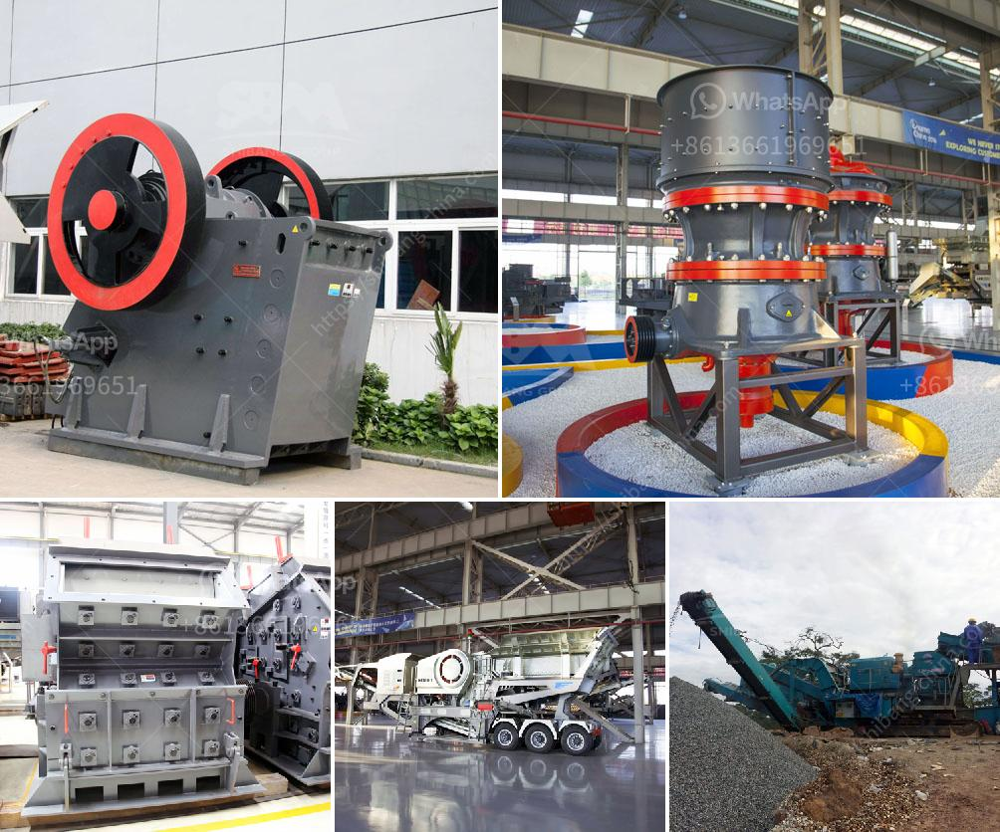

<h3>vertical spindle roller mill</h3>
The vertical spindle roller mill is widely used in the fields of cement, electricity, steel, nonmetallic ore, etc. It can grind cement raw materials, slag, coal, etc. into powder. It is a versatile grinding mill and has a wide range of applications.

The operation principle of the vertical spindle roller mill is similar to that of a ball mill. The raw material is fed into the mill through the central inlet pipe, and falls onto the grinding table. The rotation of the grinding table accelerates the material towards the grinding roller, which applies high pressure and grinds the material. The ground material is then blown by the airflow from the mill outlet up to the classifier, where the fine particles are separated and collected, while the coarse particles are returned to the grinding table for further grinding.

One of the main advantages of the vertical spindle roller mill is its energy efficiency. Compared to a ball mill, it consumes 20-30% less energy. This not only reduces the operating costs but also helps to reduce carbon emissions, making it an environmentally friendly option. The high-pressure grinding roller also contributes to its energy efficiency. By applying high pressure, it can crush and grind the material more effectively, resulting in a finer product with less energy consumption.

Another advantage of the vertical spindle roller mill is its ability to dry the material during the grinding process. The hot air from the mill outlet can be used to dry the raw material, eliminating the need for a separate drying process. This saves both energy and time, making the mill more efficient and productive.

In terms of maintenance, the vertical spindle roller mill is relatively easy to operate and maintain. It has fewer moving parts compared to other grinding mills, which reduces the risk of mechanical failure. The grinding rollers and the grinding table can be easily replaced when worn out, ensuring a longer service life of the mill.

In conclusion, the vertical spindle roller mill is a versatile and efficient grinding mill with many applications. Its energy efficiency, ability to dry the material, and easy maintenance make it an attractive option for various industries. Whether it is used for grinding cement raw materials, slag, coal, or other materials, the vertical spindle roller mill offers a cost-effective and environmentally friendly solution.
<h3>Contact us</h3><ul><li><strong>Whatsapp:&nbsp;<a href="https://wa.me/8613661969651">+8613661969651</a></strong></li><li><a href="https://swt.shibang-china.com/?git&amp;zhl&amp;vertical spindle roller mill"><strong>Online Service(chat now)</strong></a></li></ul><h3>Related</h3><ul><li><a href='jaw bone crusher made in britain.md'>jaw bone crusher made in britain</a></li><li><a href='sand washing machinery.md'>sand washing machinery</a></li><li><a href='best crushers for manufactured sand.md'>best crushers for manufactured sand</a></li><li><a href='brand new cone crusher for sale india.md'>brand new cone crusher for sale india</a></li><li><a href='stone quarry crusher companies in ghana.md'>stone quarry crusher companies in ghana</a></li></ul>