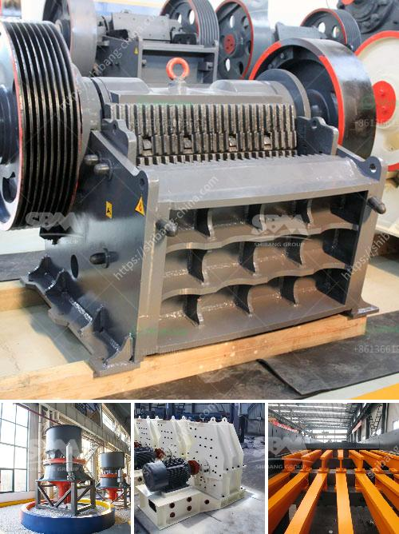

<h3>vibrating screen for fine sand</h3>
Fine sand is a crucial material for various construction and landscaping projects. To ensure the quality and integrity of the final product, the material needs to be properly screened. This is where a vibrating screen comes into play.

A vibrating screen is a simple yet highly efficient piece of equipment that can sort, classify, and dewater fine sand. Vibrating screens help to separate particles according to their size and remove unwanted impurities, ensuring high-quality sand with consistent particle gradation.

One of the main advantages of using a vibrating screen for fine sand is its ability to perform multiple functions in a single operation. Besides screening, it can also convey, dewater, and separate materials according to their specific properties. This versatility eliminates the need for additional equipment and streamlines the entire process.

The design of a vibrating screen for fine sand is crucial to its performance and efficiency. The screen surface must be selected based on the specific characteristics of the sand, such as its particle size distribution, moisture content, and abrasiveness. Additionally, the vibrating motion produced by the screen should be optimized to achieve the desired separation and dewatering results.

One key feature of a vibrating screen for fine sand is the use of high-frequency vibrations. These vibrations help to enhance the separation process by generating forces that allow smaller particles to pass through the screen openings while larger particles are retained. This results in a higher percentage of fine material being separated and a more efficient screening operation.

Furthermore, vibrating screens for fine sand often include features such as adjustable amplitude, adjustable slope angle, and rubber spring suspensions. These features allow for precise control of the screening process, enabling operators to maximize the screening efficiency and overall production capacity.

In conclusion, a vibrating screen for fine sand is an essential tool for any construction or landscaping project that requires high-quality sand. Its versatility, efficiency, and ability to perform multiple functions make it a valuable asset in the sand screening process. By using a vibrating screen, producers can ensure a consistent particle gradation, remove impurities, and ultimately deliver a superior product to their customers.
<h3>Contact us</h3><ul><li><strong>Whatsapp:&nbsp;<a href="https://wa.me/8613661969651">+8613661969651</a></strong></li><li><a href="https://swt.shibang-china.com/?git&amp;zhl&amp;vibrating screen for fine sand"><strong>Online Service(chat now)</strong></a></li></ul><h3>Related</h3><ul><li><a href='costs of ball mills.md'>costs of ball mills</a></li><li><a href='hammer crusher hammer balancing chart.md'>hammer crusher hammer balancing chart</a></li><li><a href='how to start a stone crushing company in canada.md'>how to start a stone crushing company in canada</a></li><li><a href='ballast crushing machinery.md'>ballast crushing machinery</a></li><li><a href='price of zenithcrusher plant.md'>price of zenithcrusher plant</a></li></ul>