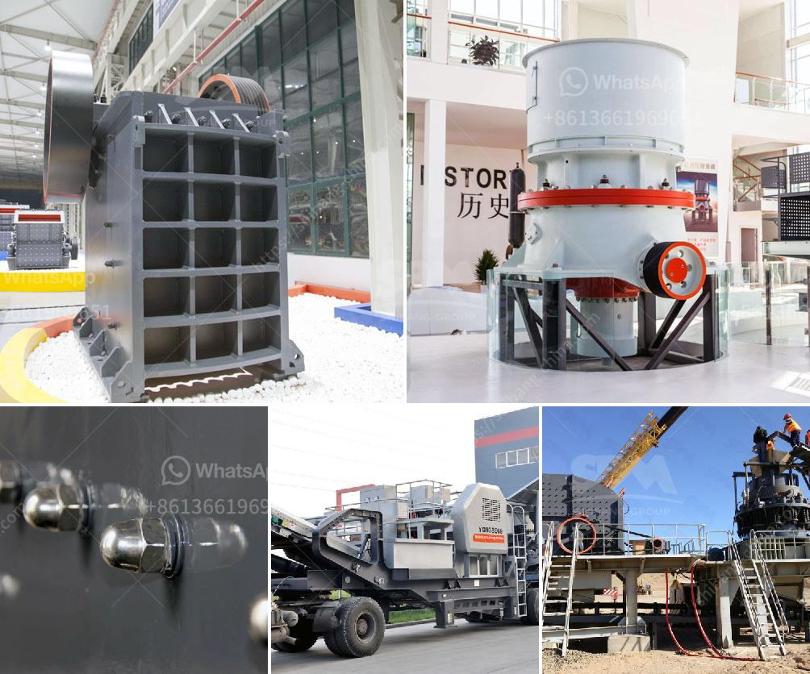

<h3>vibrating screen made in the philippines</h3>
Vibrating screens have become an integral part of various industries, including mining, agriculture, pharmaceutical, food processing, and more. These machines play a crucial role in separating and sorting materials, improving efficiency, reducing downtime, and enhancing product quality. In recent years, the Philippines has emerged as a leading manufacturer of high-quality vibrating screens, offering innovative solutions that meet diverse industry needs. Let us explore the strengths and developments of Philippine-made vibrating screens.

The Philippines has a robust manufacturing sector known for its skilled workforce and cost-effective production capabilities. Vibrating screen manufacturers in the country adhere to strict quality standards, employing advanced manufacturing techniques and utilizing durable materials to ensure the longevity and reliability of their products.

Philippines-made vibrating screens are constructed using high-quality stainless steel, ensuring resistance to corrosion, wear, and abrasion. The use of superior materials enhances the durability of the screens, extending their lifespan even in demanding industrial environments.

Furthermore, the manufacturers employ rigorous quality control measures throughout the production process to maintain consistency and precision. Each vibrating screen undergoes strict testing before it is released to the market, assuring customers of its performance and functionality.

Philippine manufacturers continue to invest in research and development, resulting in innovative designs that improve the effectiveness and efficiency of vibrating screens. These technological advancements have enabled the screens to handle varying amounts of material and handle more complex separation and classification processes.

Some manufacturers have introduced multi-layer vibrating screens that allow for simultaneous separation and classification of materials, enhancing productivity. These screens feature adjustable vibration intensity and frequency, allowing users to fine-tune the machine's performance according to specific requirements.

Additionally, modern Philippine-made vibrating screens boast user-friendly interfaces and automation features, simplifying operation and increasing productivity. The integration of intelligent sensors and software enables real-time monitoring and adjustments, reducing maintenance costs and minimizing downtime.

Philippine manufacturers of vibrating screens understand the diverse requirements of different industries. They offer customization options to tailor the screens to specific applications, ensuring optimal performance and productivity.

Moreover, these manufacturers prioritize after-sales service by providing comprehensive customer support. They offer installation assistance, training, and technical consultation to maximize the efficiency and lifespan of their vibrating screens. This commitment to customer satisfaction has earned the trust and loyalty of domestic and international clients.

The Philippine-made vibrating screens are on par with internationally recognized brands, thanks to the country's manufacturing capabilities, focus on quality, and technological advancements. These machines have proven their efficiency and reliability across various industries, helping businesses improve their production processes and achieve higher quality standards. With a commitment to continuous innovation and customer support, Philippine manufacturers are set to further strengthen their presence in the global vibrating screen market.
<h3>Contact us</h3><ul><li><strong>Whatsapp:&nbsp;<a href="https://wa.me/8613661969651">+8613661969651</a></strong></li><li><a href="https://swt.shibang-china.com/?git&amp;zhl&amp;vibrating screen made in the philippines"><strong>Online Service(chat now)</strong></a></li></ul><h3>Related</h3><ul><li><a href='mini cement plants manufacturer africa.md'>mini cement plants manufacturer africa</a></li><li><a href='granite crusher machine.md'>granite crusher machine</a></li><li><a href='special electrodes for ball mill.md'>special electrodes for ball mill</a></li><li><a href='calcium carbonate machine.md'>calcium carbonate machine</a></li><li><a href='jaw rock crusher for sale.md'>jaw rock crusher for sale</a></li></ul>