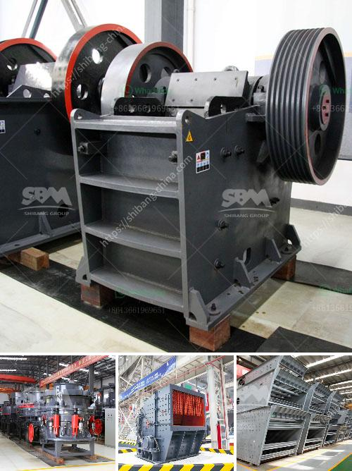

<h3>vibrating screen manufacture in philippines</h3>
Vibrating screen manufacture in Philippines has been a leading supplier of technically advanced vibrating screen machines since its establishment in 1996. Broadly, the vibrating screens are used to separate materials into various sizes for further processing in Crusher. Vibrating screen works on a mechanism called the Gyro Screen, which sifts through various materials like sand, grain, and gravel to separate them based on size.

The vibrating screen manufacture in Philippines employs a highly trained and experienced team of engineers to assemble and finish the products to the highest standard. The company also provides excellent after-sales service, ensuring that the customers receive all the support they need.

One of the key advantages of choosing a vibrating screen from a reputable manufacturer is the high-quality materials used in the construction. The screens are designed to withstand heavy use and provide reliable performance year after year. By investing in a durable and reliable vibrating screen, customers can avoid costly breakdowns and maintenance issues.

Furthermore, the manufacturer performs rigorous quality control checks at every stage of the manufacturing process to ensure that the final product meets the highest standards. This attention to detail ensures that the screens are suitable for a wide range of applications and can effectively handle different types of materials.

In addition to the quality of the product, manufacturers in the Philippines also offer customized solutions to meet the specific requirements of their customers. This level of flexibility allows businesses to optimize their operations and improve efficiency by integrating vibrating screens seamlessly into their production line.

To conclude, vibrating screen manufacture in the Philippines offers high-quality machines that are built to last and provide reliable performance. With their experienced team of engineers, rigorous quality control checks, and customization options, they are well-equipped to meet the diverse needs of their customers. Whether it's for separating sand, gravel, or other materials, businesses can rely on the vibrating screens manufactured in the Philippines to improve their production processes.
<h3>Contact us</h3><ul><li><strong>Whatsapp:&nbsp;<a href="https://wa.me/8613661969651">+8613661969651</a></strong></li><li><a href="https://swt.shibang-china.com/?git&amp;zhl&amp;vibrating screen manufacture in philippines"><strong>Online Service(chat now)</strong></a></li></ul><h3>Related</h3><ul><li><a href='jaw crusher calculating.md'>jaw crusher calculating</a></li><li><a href='barytes processing equipment.md'>barytes processing equipment</a></li><li><a href='mobile crushing plant for sale in africa.md'>mobile crushing plant for sale in africa</a></li><li><a href='limestone small crusher machine.md'>limestone small crusher machine</a></li><li><a href='ultrafine ball mills machine.md'>ultrafine ball mills machine</a></li></ul>