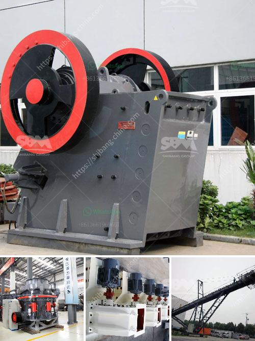

<h3>vibrating screens for material crusher</h3>
Vibrating screens are an important part of material crushing and screening operations. They are designed to separate materials based on their size, shape, and density, helping to ensure efficient and effective operation of the crusher.

Vibrating screens consist of a drive mechanism, springs, screen deck(s), and supporting structure. The drive mechanism is responsible for generating the vibration, which is used to move the material along the screen and to convey it to the desired location. This mechanism may be powered by an electric motor or hydraulic system.

The springs play a crucial role in the functioning of vibrating screens. They absorb the vibration generated by the drive mechanism and provide stability to the screen deck. The screen deck(s) is where the material is fed onto the screen and separated into different sizes. The supporting structure ensures the stability and strength of the vibrating screen.

One of the key advantages of vibrating screens is their versatility. They can be used with various types of materials, including aggregates, minerals, metals, and chemicals. The screens' adjustable settings allow for different screening options, such as fine, coarse, and wet screening.

In addition to their versatility, vibrating screens offer several benefits. Firstly, they improve the performance of the material crusher by ensuring consistent material size and quality. This leads to better efficiency and more uniform final product. Secondly, they help to reduce downtime and maintenance costs by preventing unwanted material from entering the crusher, which can cause blockages and damage. Finally, vibrating screens contribute to a cleaner working environment by capturing dust and other particles.

In conclusion, vibrating screens are essential components in material crushing and screening processes. They play a crucial role in improving the efficiency and effectiveness of the crusher, while also reducing downtime and maintenance costs. With their versatility and ability to handle various materials, vibrating screens are an indispensable tool for any material crusher.
<h3>Contact us</h3><ul><li><strong>Whatsapp:&nbsp;<a href="https://wa.me/8613661969651">+8613661969651</a></strong></li><li><a href="https://swt.shibang-china.com/?git&amp;zhl&amp;vibrating screens for material crusher"><strong>Online Service(chat now)</strong></a></li></ul><h3>Related</h3><ul><li><a href='mobile crusher morocco price.md'>mobile crusher morocco price</a></li><li><a href='cone crusher germany.md'>cone crusher germany</a></li><li><a href='quarry crusher factors.md'>quarry crusher factors</a></li><li><a href='find a portable hand operated rock crusher.md'>find a portable hand operated rock crusher</a></li><li><a href='cement clinker ball mill.md'>cement clinker ball mill</a></li></ul>