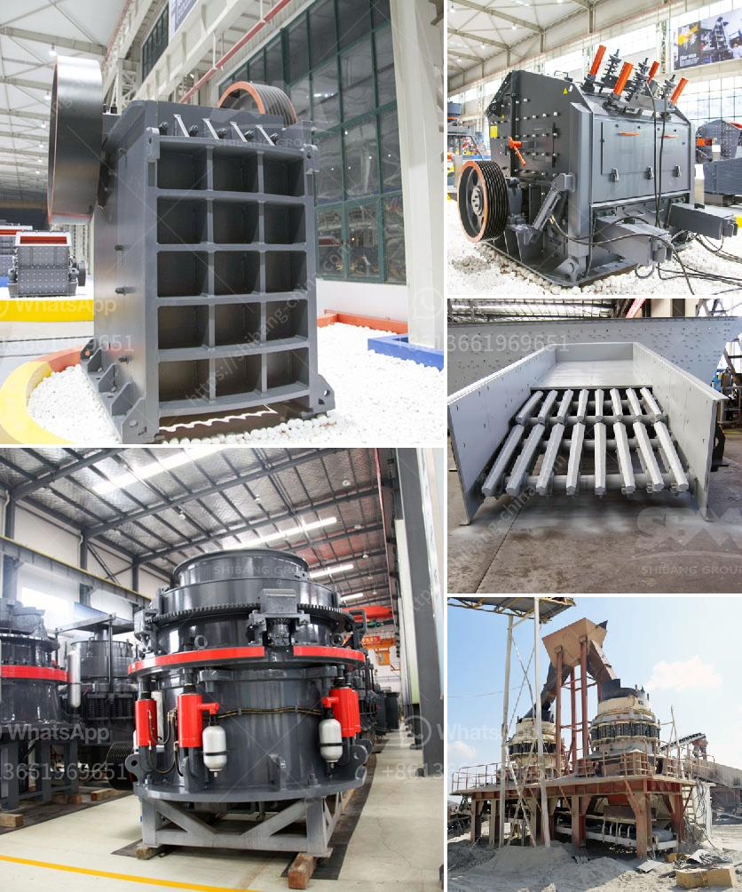

<h3>vibrating screens pictures</h3>
Vibrating screens are a crucial tool in the mining and quarrying industries. They are used to separate particles and substances based on their size and shape. Vibrating screens have many advantages, such as simple structure, lower cost, high efficiency, and easy maintenance. However, understanding the fundamentals of vibrating screens is essential to using them effectively.

A vibrating screen consists of a vibrating mechanism, deck, and screen panels. The vibrator is an eccentric shaft that rotates under a belt or direct drive. The mechanism creates a vibratory motion, which helps to separate particles and substances by size. The deck is the framework on which the screen panels are mounted. It supports the weight of the panels and the materials being screened. The screen panels are available in various materials and configurations, depending on the application.

One of the best ways to understand the working principle and design of vibrating screens is through pictures. These pictures provide a visual representation of how the screens are constructed and how they function. Vibrating screen pictures demonstrate the basic components and parts of a vibrating screen, including the vibrating mechanism, deck, and screen panels.

The vibrating mechanism consists of an eccentric shaft with a pulley or sheave that is mounted on springs. These springs allow the shaft to move in a circular motion, creating the necessary vibratory motion. The mechanism is typically positioned at the center of the screen, ensuring that the screen deck vibrates uniformly. The vibrating mechanism can be powered by either an electric motor or a hydraulic motor, depending on the size and capacity requirements.

The deck of a vibrating screen is the main framework that supports the screen panels. It is usually constructed from steel or other sturdy materials to withstand the heavy workload and vibrations. The deck is designed to provide a level and stable surface for the screen panels. It also prevents any leakage of material or liquids from the screen.

The screen panels are the essential components of a vibrating screen. They are responsible for separating particles and substances based on their size and shape. The panels can be made from various materials, such as woven wire, polyurethane, rubber, or perforated metal. Each material has its unique benefits and is suitable for different applications. The configuration of the panels, such as the size of the openings or the angle of inclination, can be customized based on the specific requirements of the application.

In conclusion, vibrating screens are indispensable in the mining and quarrying industries. They help to separate particles and substances efficiently, leading to increased productivity and reduced downtime. Understanding the structure and operation of vibrating screens is critical for their effective use. Pictures of vibrating screens provide a visual representation of their components and functioning. These pictures are invaluable resources for learning and optimizing the performance of vibrating screens.
<h3>Contact us</h3><ul><li><strong>Whatsapp:&nbsp;<a href="https://wa.me/8613661969651">+8613661969651</a></strong></li><li><a href="https://swt.shibang-china.com/?git&amp;zhl&amp;vibrating screens pictures"><strong>Online Service(chat now)</strong></a></li></ul><h3>Related</h3><ul><li><a href='how to remove gold dust from sand.md'>how to remove gold dust from sand</a></li><li><a href='prices for cement processing machines.md'>prices for cement processing machines</a></li><li><a href='open cast coal mining machinery process.md'>open cast coal mining machinery process</a></li><li><a href='quarry machine for sale.md'>quarry machine for sale</a></li><li><a href='marble mining equipment.md'>marble mining equipment</a></li></ul>