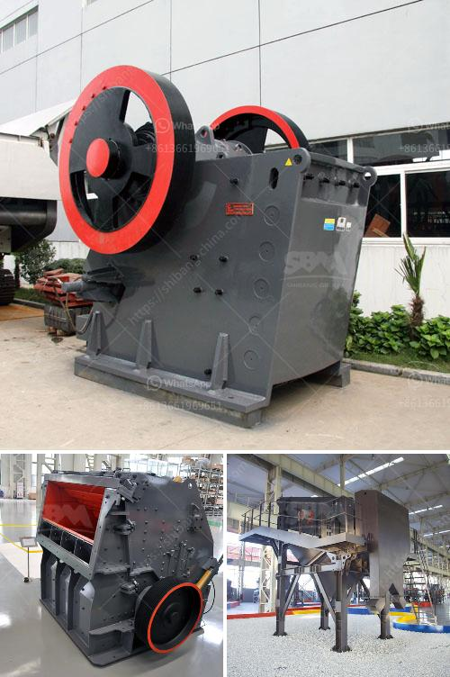

<h3>vibrating screens price in south africa</h3>
Vibrating screens are commonly used in the mining industry. They help to separate materials based on their size. They are also used for dewatering and sorting materials. Vibrating screens are widely used in many industries due to their efficiency and performance. However, they come at a price.

Vibrating screens are commonly used in the mining industry. In fact, vibrating screens are widely used in the mining industry, especially in the extraction and processing of coal. These screens play a crucial role in separating the materials, crushing them, and sorting them. Nowadays, they are also used in other industries, such as food processing, chemical manufacturing, metallurgy, and many others.

The price of vibrating screens in South Africa depends on several factors including the brand, model, and specifications of the equipment. However, the main factors affecting the price of vibrating screens are the type of material processed and the design of the equipment. Typically, vibrating screens are priced at around $10,000 to $150,000.

The cost of a vibrating screen machine varies depending on the demands of the customers. Some clients prefer an inclined vibrating screen, while others would rather choose a horizontal one. Some manufacturers offer machines that can be customized to meet the specific requirements of the customers. Additionally, the materials used in the manufacturing of the vibrating screens also affect the price. For instance, screens made with high-quality stainless steel will be more expensive than those made with regular steel.

It's important to note that the vibrating screen price is just one aspect to consider when purchasing this equipment. It's crucial to also consider the quality and durability of the machine. Cheaper screens may have a shorter lifespan and may require more frequent maintenance and repairs, leading to additional expenses in the long run.

Many vibrating screen manufacturers in South Africa offer free installation and ongoing maintenance services for their products. It's always recommended to opt for manufacturers that offer warranty and after-sales support, as this can save buyers from potential headaches and additional costs.

When purchasing a vibrating screen in South Africa, it's essential to do thorough research and compare the prices and services offered by different manufacturers. Additionally, it's beneficial to read customer reviews and testimonials to get an idea of the overall satisfaction level of previous buyers.

In conclusion, vibrating screens play a crucial role in various industries in South Africa. The price of vibrating screens varies depending on the type of material processed and the design of the equipment. It's important to consider the quality and durability of the machine to make a cost-effective decision. Doing thorough research and comparing prices and services are essential steps in finding the best vibrating screen for your specific needs.
<h3>Contact us</h3><ul><li><strong>Whatsapp:&nbsp;<a href="https://wa.me/8613661969651">+8613661969651</a></strong></li><li><a href="https://swt.shibang-china.com/?git&amp;zhl&amp;vibrating screens price in south africa"><strong>Online Service(chat now)</strong></a></li></ul><h3>Related</h3><ul><li><a href='ball mills for rent.md'>ball mills for rent</a></li><li><a href='big slage crusher mechins plant.md'>big slage crusher mechins plant</a></li><li><a href='mtm trapezium grinder mill.md'>mtm trapezium grinder mill</a></li><li><a href='crusher plant in jizan saudi arabia.md'>crusher plant in jizan saudi arabia</a></li><li><a href='aggregate crushing contract in mexico.md'>aggregate crushing contract in mexico</a></li></ul>