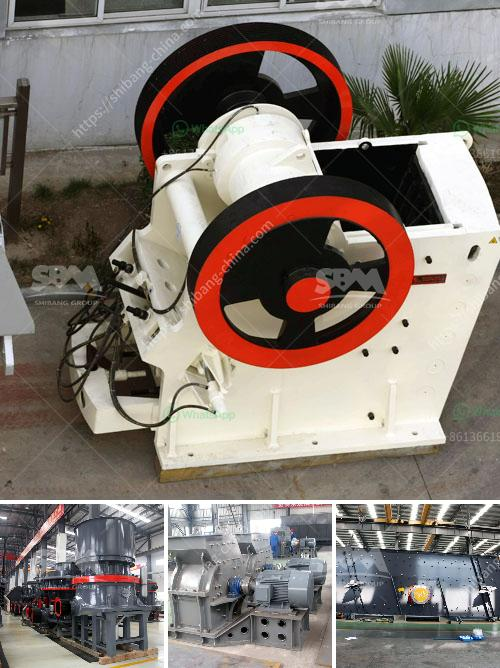

<h3>vibration screen machine in pakistan</h3>
In today's fast-paced world, industries are constantly seeking innovative solutions to enhance their efficiency and productivity. One such solution that has gained immense popularity in Pakistan is the vibration screen machine. This advanced equipment is primarily used for sorting, grading, and separating various materials based on their sizes.

The vibration screen machine operates through a series of vibrations or oscillations that allow efficient separation of different particles. It consists of multiple layers or decks with different mesh sizes, enabling the separation of various materials in a single process. This eliminates the need for multiple equipment, thus saving both time and cost.

One of the significant advantages of the vibration screen machine is its ability to handle a large volume of material. Whether it is mining, construction, or recycling industries, this versatile equipment can efficiently handle bulk quantities. Moreover, it is designed to withstand harsh conditions, making it suitable for industries operating in rugged environments.

Additionally, the vibration screen machine offers high accuracy in sorting and grading materials. It ensures that only the desired particles pass through the screen, while the oversized or undersized particles are rejected. This results in improved product quality and consistency, leading to higher customer satisfaction.

Furthermore, the vibration screen machine is incredibly easy to operate and maintain. It is equipped with user-friendly controls and requires minimum training for operation. Regular maintenance, such as lubrication and cleaning, ensures its optimal performance and longevity.

The demand for vibration screen machines in Pakistan has been steadily growing, thanks to its numerous benefits. Various industries, such as mining, pharmaceuticals, chemical, and food processing, have integrated this equipment into their production processes. Not only does it streamline their operations, but it also minimizes human error, reducing the chances of product failure.

In conclusion, the vibration screen machine has revolutionized the industrial sector in Pakistan. Its ability to efficiently sort, grade, and separate materials has significantly enhanced efficiency and productivity. With its durability, accuracy, and ease of operation, it has become a popular choice for industries across various sectors. As Pakistan's industrial landscape continues to evolve, the vibration screen machine will undoubtedly play a crucial role in driving progress and success.
<h3>Contact us</h3><ul><li><strong>Whatsapp:&nbsp;<a href="https://wa.me/8613661969651">+8613661969651</a></strong></li><li><a href="https://swt.shibang-china.com/?git&amp;zhl&amp;vibration screen machine in pakistan"><strong>Online Service(chat now)</strong></a></li></ul><h3>Related</h3><ul><li><a href='design drawings of a hammer mill.md'>design drawings of a hammer mill</a></li><li><a href='crusher plant in jizan saudi arabia.md'>crusher plant in jizan saudi arabia</a></li><li><a href='crusher for sale 120 ton.md'>crusher for sale 120 ton</a></li><li><a href='quartz grinding ball mill.md'>quartz grinding ball mill</a></li><li><a href='quartz crushing plant german tecnology.md'>quartz crushing plant german tecnology</a></li></ul>