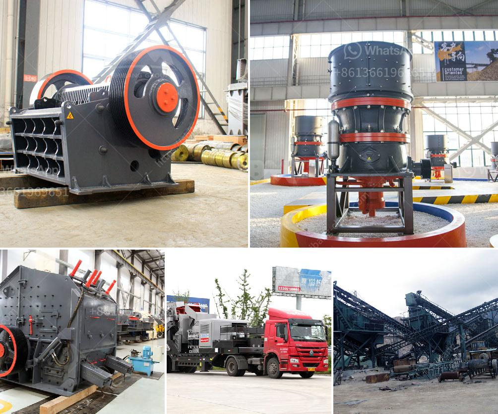

<h3>vibrator machine for concrete</h3>
In the world of construction, efficiency and productivity are paramount to meet project deadlines while ensuring quality standards. One indispensable tool that aids in achieving these goals is the vibrator machine for concrete. This innovative device not only improves the concrete pouring process but also enhances the overall strength and durability of the concrete structures.

Vibrator machines for concrete, also known as concrete vibrators or concrete consolidators, are equipment used to remove air bubbles and excess water from freshly poured concrete. They consist of a motor that generates vibration, typically with an eccentric weight attached to it. The vibrations are transferred to the concrete through a flexible hose or shaft connected to a vibrating head or poker.

The primary purpose of using a vibrator machine is to eliminate air voids within the poured concrete. Air voids can adversely affect the structural integrity of concrete, leading to potential cracks and weaknesses. By applying vibrations, the vibrator machine compacts and densifies the concrete, resulting in a more robust and durable finished product.

One of the significant advantages of using vibrator machines is their ability to facilitate concrete placement in hard-to-reach areas. The flexible hose or shaft allows workers to reach confined spaces, corners, and edges that would otherwise require manual tamping or vibration. This not only saves labor but also ensures a consistent compaction across the entire concrete structure, avoiding weak spots.

Furthermore, vibrator machines significantly reduce the time required for concrete pouring and compaction. By employing vibrations, the concrete settles quickly, eliminating the need for excessive manual effort to level and smooth the surface. This efficiency translates into shorter project durations, enabling contractors to meet tight deadlines without compromising quality standards.

The use of vibrator machines also leads to improved surface finishes. By removing excess air voids, the final concrete surface becomes more homogeneous, exhibiting better texture and appearance. This is especially critical when constructing exposed architectural elements, where aesthetics play a vital role.

It is worth mentioning that different types of vibrator machines are available in the market to cater to specific project requirements. High-frequency vibrators are typically used for low-slump concrete mixes, while low-frequency vibrators are suitable for higher slump applications. Additionally, external vibrators can be utilized for large-scale projects such as bridge construction, while internal vibrators are ideal for smaller residential or commercial projects.

While vibrator machines offer numerous benefits, proper handling and safety precautions are essential. Workers should be adequately trained on the correct usage, including the appropriate poker size and frequency settings for specific concrete mixes. Over-vibration can lead to segregation or bleeding of the concrete mix, compromising its quality.

In conclusion, vibrator machines for concrete have revolutionized the construction industry by enhancing efficiency and productivity. These devices enable the compaction and consolidation of fresh concrete, providing stronger and more durable structures. With their ability to reach confined spaces and accelerate the concrete placement process, vibrator machines save time and labor costs. By ensuring consistent compaction, they also contribute to improved surface finishes and overall quality. As construction projects continue to demand speed and optimal performance, investing in vibrator machines for concrete is undoubtedly a wise choice.
<h3>Contact us</h3><ul><li><strong>Whatsapp:&nbsp;<a href="https://wa.me/8613661969651">+8613661969651</a></strong></li><li><a href="https://swt.shibang-china.com/?git&amp;zhl&amp;vibrator machine for concrete"><strong>Online Service(chat now)</strong></a></li></ul><h3>Related</h3><ul><li><a href='jaw crusher calculating.md'>jaw crusher calculating</a></li><li><a href='gold crusher machine.md'>gold crusher machine</a></li><li><a href='used stone crusher in ontario.md'>used stone crusher in ontario</a></li><li><a href='stone crusher in inda or parkistan.md'>stone crusher in inda or parkistan</a></li><li><a href='stone crusher in cameroon.md'>stone crusher in cameroon</a></li></ul>