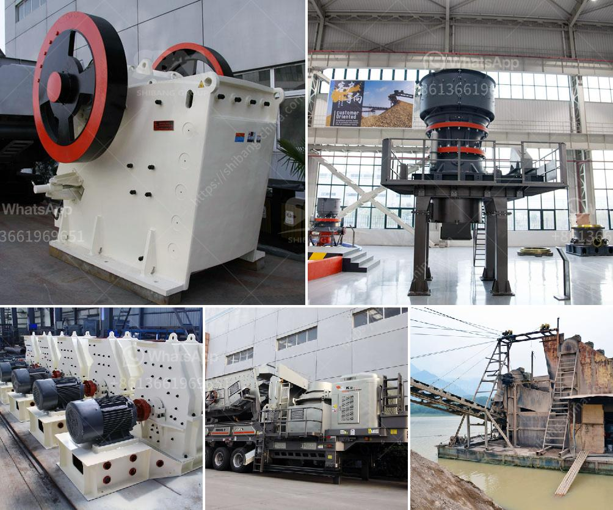

<h3>vibrator screen for coal</h3>
Coal, as a vital fuel source, plays a significant role in various industries. However, efficient processing and sorting of coal is crucial for maximizing its usability. Vibrator screens have emerged as a reliable solution for coal processing, aiding in improved efficiency, reduced downtime, and optimum productivity.

Vibrator screens in coal processing plants are pivotal in the initial separation and classification of coal particles of different sizes. These screens efficiently remove oversized or undersized particles, ensuring the coal meets the desired specifications required by end-users. The vibrating motion of these screens effectively eliminates blockages and aids in the even distribution of coal onto conveyor belts for further processing. By using different screen decks with varying aperture sizes, the vibrator screens can optimize the separation process, resulting in a cleaner and higher-quality final product.

Inefficient coal processing can lead to excessive downtime, reduced productivity, and compromised quality. With vibrator screens, the coal processing workflow becomes more streamlined and efficient. These screens automatically remove any foreign material, such as rocks or debris, present in the coal, reducing the risk of equipment damage further along the processing line. By improving the efficiency of the initial screening process, the vibrator screens contribute to significant time and energy savings, reducing operational costs and enhancing overall productivity.

Vibrator screens for coal processing are designed to withstand the harsh working conditions associated with the coal industry. They are constructed from sturdy materials such as hardened steel, ensuring durability and longevity. Routine maintenance, such as regular lubrication and inspections, helps prevent any potential issues and allows for prompt identification and replacement of damaged components. The screens' robust design and easy maintenance contribute to longer lifespan and uninterrupted operation, minimizing downtime and increasing the plant's overall efficiency.

Vibrator screens in coal processing plants are equipped with safety features that prioritize worker well-being, adhering to strict safety regulations. Additionally, the use of such screens helps minimize the release of harmful particulate matter into the environment. Efficient coal processing contributes to less environmental impact, reducing dust emissions and preventing the accumulation of coal waste. This environmentally-conscious approach not only benefits the wider ecosystem but also helps coal processing plants comply with stringent regulatory requirements, creating a sustainable and responsible industry.

The integration of vibrator screens in coal processing plants revolutionizes how coal is sorted and classified, enhancing efficiency, productivity, and overall output quality. With their enhanced screening capabilities, improved maintenance, and adherence to safety measures and environmental considerations, vibrator screens prove to be an indispensable asset for the coal industry.
<h3>Contact us</h3><ul><li><strong>Whatsapp:&nbsp;<a href="https://wa.me/8613661969651">+8613661969651</a></strong></li><li><a href="https://swt.shibang-china.com/?git&amp;zhl&amp;vibrator screen for coal"><strong>Online Service(chat now)</strong></a></li></ul><h3>Related</h3><ul><li><a href='stone quarry crusher plant price in india.md'>stone quarry crusher plant price in india</a></li><li><a href='chromite ore crushing machine.md'>chromite ore crushing machine</a></li><li><a href='rock crusher cone.md'>rock crusher cone</a></li><li><a href='new crushing machines in oman.md'>new crushing machines in oman</a></li><li><a href='mobile crusher china.md'>mobile crusher china</a></li></ul>