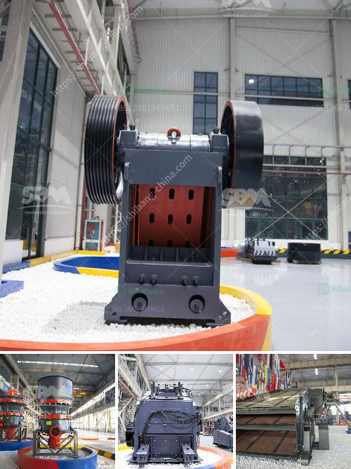

<h3>vsi crusher manufacturer</h3>
In the construction industry, the demand for sand is constantly increasing. With the depletion of natural sand resources, it is necessary to find new sources of sand that can be used as an alternative. One such solution is using manufactured sand (M-Sand) produced by crushing rocks and quarry stones into sand-sized particles. And when it comes to manufacturing high-quality M-Sand, VSI (Vertical Shaft Impactor) crushers are one of the top choices. 

VSI crushers, also known as sand-making machines, are utilized for crushing large rocks into smaller, more uniform particles. The stones are feed into the crusher through a rotor that rotates at high speeds. The rocks are then thrown against an anvils, striking them and causing them to break into smaller pieces. This process is known as rock-on-rock crushing.

First and foremost, VSI crushers are more cost-effective compared to cone crushers or impact crushers. They can provide high-quality M-Sand at a lower production cost. With the ability to produce consistent particles, VSI crushers ensure optimal particle shape and size distribution, which ultimately results in better workability and higher compressive strength of the concrete.

Secondly, VSI crushers are environmentally friendly. As they produce M-Sand from rocks instead of natural river sand, they help preserve natural resources while reducing the need for excavation. Moreover, crushed rocks from VSI crushers can be further used in other industries such as construction and road building, thus optimizing resource utilization.

Another advantage of VSI crushers is their versatility. These machines can be easily adjusted to produce different sizes of sand depending on the specific requirements of the construction project. This flexibility ensures that the crusher can meet the demands of various applications and provide customized solutions.

Now that we have highlighted the benefits of VSI crushers, it is essential to choose a reliable manufacturer that can deliver high-quality and reliable equipment. Look no further than ABC Crushers, a leading VSI crusher manufacturer with a strong reputation in the industry.

ABC Crushers has years of experience in manufacturing VSI crushers, ensuring that their machines are of the highest quality. They use advanced technology and incorporate innovative features in their crushers to ensure maximum efficiency and productivity. With a focus on customer satisfaction, ABC Crushers provide excellent after-sales support, including maintenance, spare parts, and technical assistance.

Furthermore, ABC Crushers offer competitive pricing, making their VSI crushers an excellent investment for any construction company. Whether you are looking to produce M-Sand for concrete production or need a versatile machine for various applications, ABC Crushers have a solution for you.

In conclusion, VSI crushers are essential equipment in the production of quality sand. They offer numerous advantages, including cost-effectiveness, environmental friendliness, and versatility. When choosing a VSI crusher, look no further than ABC Crushers, a manufacturer that is committed to delivering high-quality equipment and excellent customer satisfaction. Invest in a VSI crusher from ABC Crushers and make a significant contribution to the construction industry while meeting your project requirements.
<h3>Contact us</h3><ul><li><strong>Whatsapp:&nbsp;<a href="https://wa.me/8613661969651">+8613661969651</a></strong></li><li><a href="https://swt.shibang-china.com/?git&amp;zhl&amp;vsi crusher manufacturer"><strong>Online Service(chat now)</strong></a></li></ul><h3>Related</h3><ul><li><a href='manufacturers of cement grinding units in india.md'>manufacturers of cement grinding units in india</a></li><li><a href='mobile stone crusher suppliers.md'>mobile stone crusher suppliers</a></li><li><a href='impact hammer crusher.md'>impact hammer crusher</a></li><li><a href='granite rock crusher.md'>granite rock crusher</a></li><li><a href='how much would it cost to start a gravel quarry.md'>how much would it cost to start a gravel quarry</a></li></ul>