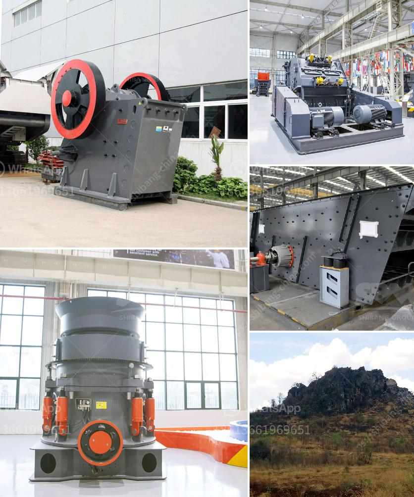

<h3>vsi5x crusher for sale</h3>
The VSI5X crusher is a popular and efficient crushing machine that is often utilized in various industries. It is particularly known for its ability to produce high-quality sand and aggregates. This crusher has become a staple in many construction and mining projects due to its outstanding performance and reliability.

One of the main advantages of the VSI5X crusher is its unique crushing process. It uses a rock-on-rock crushing method, which means that the material is crushed by the impact of the rotating rotor against the hard surface of the rock particles. This process ensures that the final product has a consistent shape and size, which is essential for construction and building purposes.

Moreover, the VSI5X crusher is equipped with advanced technology that enhances its performance. It features a dual motor drive system, which ensures a stable and balanced operation. Additionally, it has a hydraulic lifting mechanism that allows for easy maintenance and adjustment of the crushing chamber. This crusher also has a high-speed rotor, which enables it to achieve higher crushing efficiency and production capacity.

Another notable feature of the VSI5X crusher is its environmental friendliness. It is designed with a dust suppression system that minimizes the emission of dust and pollutants during the crushing process. This feature is especially crucial in today's environmentally conscious world, where reducing air pollution is a top priority.

If you are considering purchasing a VSI5X crusher, now is an excellent time to do so. Many suppliers offer these crushers for sale at competitive prices, making it more accessible for businesses of all sizes. By investing in a VSI5X crusher, you can enhance your productivity and profitability in various applications, such as aggregate production, mining, and construction.

In conclusion, the VSI5X crusher is a powerful and efficient crushing machine that is perfect for various industries. Its unique crushing process, advanced technology, and environmental friendliness make it a top choice for businesses. With the availability of the VSI5X crusher for sale, it is an opportunity for businesses to enhance their operations and achieve remarkable results.
<h3>Contact us</h3><ul><li><strong>Whatsapp:&nbsp;<a href="https://wa.me/8613661969651">+8613661969651</a></strong></li><li><a href="https://swt.shibang-china.com/?git&amp;zhl&amp;vsi5x crusher for sale"><strong>Online Service(chat now)</strong></a></li></ul><h3>Related</h3><ul><li><a href='quarry impact crusher equipment.md'>quarry impact crusher equipment</a></li><li><a href='barite mill crusher.md'>barite mill crusher</a></li><li><a href='kaolin mining crusher process.md'>kaolin mining crusher process</a></li><li><a href='coal drying plant manufacturers in china.md'>coal drying plant manufacturers in china</a></li><li><a href='gold refining equipment toronto.md'>gold refining equipment toronto</a></li></ul>