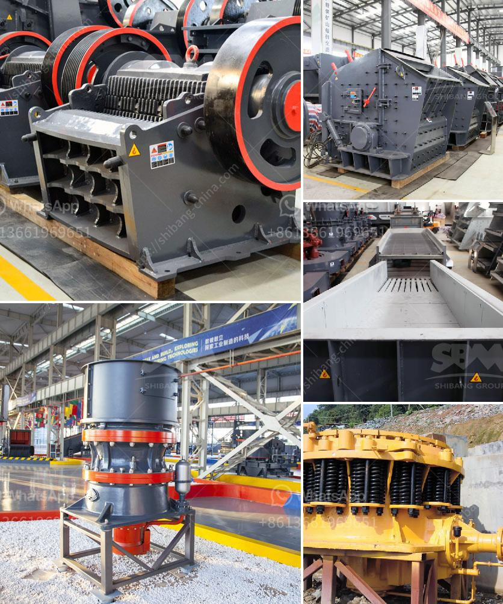

<h3>wet and dry ball milling</h3>
Ball milling has been used as a technique for grinding materials efficiently for many years, making it a popular choice in many industries. It is widely employed in a variety of applications, from building materials to pharmaceuticals. There are two grinding modes commonly used in ball mills: wet and dry milling. Understanding which method is most suitable for your specific needs is crucial in determining the overall efficiency and success of your grinding process. In this article, we will explore the differences between wet and dry ball milling and their advantages and disadvantages.

In wet ball milling, solid particles are dispersed in a liquid slurry before being reduced in size. The resulting particle size distribution is narrower than that obtained from dry milling, which makes wet milling suitable for fine grinding. The cooling effect of the liquid prevents the temperature of the process from rising too high, thus avoiding thermal degradation of the product. This cooling effect also ensures that the wet milling process complies with critical particle size specifications required for the final product.

One of the main advantages of wet milling is the suppression of dust formation due to the presence of the liquid phase. This reduces the risk of product contamination and minimizes the creation of hazardous atmospheres. Additionally, wet milling prevents the agglomeration of particles, resulting in a more uniform and homogenous final product with improved quality.

In dry ball milling, the grinding occurs in absence of liquid or solvent. Some advantages of dry ball mill processes include producing a fine particle size distribution, comparable to that obtained in wet milling approaches. Additionally, dry milling provides reduced wear and tear on the equipment, as it does not require the use of liquids or slurries. This leads to lower maintenance costs and a longer lifespan for the machinery.

However, dry ball milling has its limitations. It tends to be ineffective in reducing the particle size of brittle materials, such as ceramics or minerals. Dry milling also requires a specific type of mill, known as a ball mill, which can be expensive to install and maintain. Lastly, dry milling requires specific additives, such as anti-settling agents or grinding aids, to prevent agglomeration or caking of the particles.

Selecting the appropriate milling method, whether wet or dry, depends on various factors, including the desired particle size, the material's properties, and the specific requirements of the end product. Each technique has its own advantages and disadvantages, making it critical to evaluate these aspects before making a decision. It is also worth considering that a combination of wet and dry milling may be employed in some cases to achieve the desired particle size distribution and reduce production costs.

In summary, wet and dry ball milling are two versatile techniques, each with their unique advantages and limitations. Wet milling offers better control of particle size distribution and prevents dust formation and product contamination. On the other hand, dry milling requires less maintenance and specialized equipment. Ultimately, the choice between wet and dry milling should be made based on the specific needs and goals of the grinding process.
<h3>Contact us</h3><ul><li><strong>Whatsapp:&nbsp;<a href="https://wa.me/8613661969651">+8613661969651</a></strong></li><li><a href="https://swt.shibang-china.com/?git&amp;zhl&amp;wet and dry ball milling"><strong>Online Service(chat now)</strong></a></li></ul><h3>Related</h3><ul><li><a href='mobile crusher morocco price.md'>mobile crusher morocco price</a></li><li><a href='sand crusher price.md'>sand crusher price</a></li><li><a href='calcium carbonate crusher.md'>calcium carbonate crusher</a></li><li><a href='granite roller mill.md'>granite roller mill</a></li><li><a href='mill ore grind size passing 200 mesh.md'>mill ore grind size passing 200 mesh</a></li></ul>