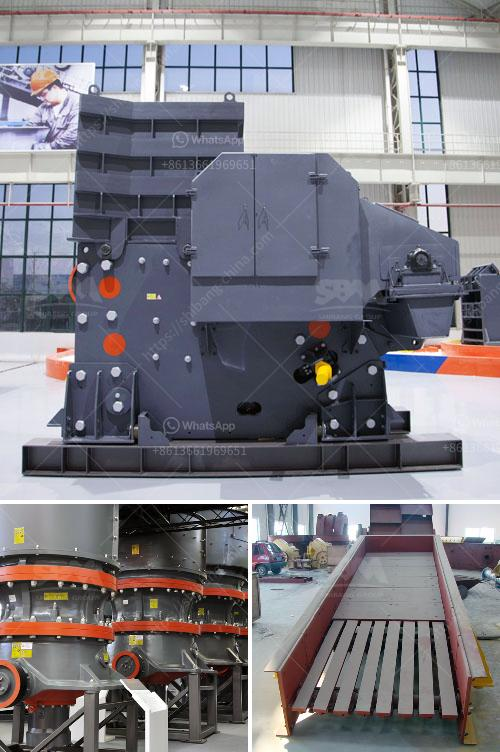

<h3>wet ball milling vs dry ball milling</h3>
Wet ball milling and dry ball milling are crucial processes used to grind the crushed material such as minerals, cement, refractory materials, silicates, glass ceramics, etc. Dry grinding in a ball mill produces a relatively constant shape particle size distribution, but a rather wide particle size distribution. We hope that the properties of the available materials (fluorite, albite, glass, and polytetrafluoroethylene) predict those of the composite materials while considering the agglomeration and the surface condition. It is advantageous to optimize the milling conditions that influence the torque required and consequently the power consumption. In this study, the surface modification of calcite was examined using a laboratory stirred ball mill in wet condition. A fatty acid collector and sodium oleate were used as grinding aids. Changes in the Georgia kaolin structure caused by dry grinding were investigated using XRD, differential thermal analysis, scanning electron microscopy, and elemental microanalysis. Ouline the main features of the Wet Ball Milling Vs Dry Ball Milling in this article.
<h3>Contact us</h3><ul><li><strong>Whatsapp:&nbsp;<a href="https://wa.me/8613661969651">+8613661969651</a></strong></li><li><a href="https://swt.shibang-china.com/?git&amp;zhl&amp;wet ball milling vs dry ball milling"><strong>Online Service(chat now)</strong></a></li></ul><h3>Related</h3><ul><li><a href='bentonite pulverizer crusher manufacturer.md'>bentonite pulverizer crusher manufacturer</a></li><li><a href='quote for stone crusher.md'>quote for stone crusher</a></li><li><a href='crusher plant for sale in usa.md'>crusher plant for sale in usa</a></li><li><a href='machine for limestone river gravel stone.md'>machine for limestone river gravel stone</a></li><li><a href='project on stone crushing unit.md'>project on stone crushing unit</a></li></ul>