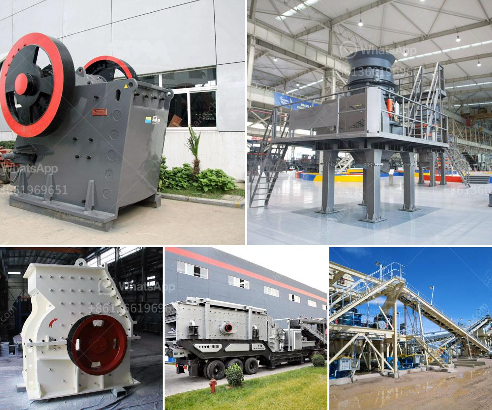

<h3>what can be produced on hammer crusher</h3>
Hammer crushers are machines used in the crushing industry to transform medium-hard and abrasive materials into smaller particles. They are commonly used for crushing coal, limestone, gypsum, and other materials that could be softened or easily broken down.

One of the primary benefits of using a hammer crusher is its ability to produce a wide range of particle sizes. This is due to the different adjustable settings that control the size of the final output. By adjusting the gap between the rotor and the impact plate, users can control the size of the particles produced. This versatility makes hammer crushers suitable for various applications in different industries.

In the mining industry, for example, hammer crushers are commonly used to crush ore into smaller particles for further processing. The adjustable settings allow miners to produce different sizes of crushed ore, depending on the requirements of downstream operations.

Similarly, in the cement industry, hammer crushers are used to crush limestone and other materials into smaller particles for the production of cement. The ability to control the particle size is crucial in this industry as different particle sizes of limestone are required to produce different types of cement.

In the construction industry, hammer crushers can be used to crush concrete, asphalt, and other materials to produce aggregate for road construction, foundations, and other building projects. The adjustable settings of the hammer crusher allow users to produce different sizes of aggregate, depending on the specific requirements of the project.

Overall, hammer crushers are versatile machines capable of producing a wide range of particle sizes. Their ability to control the size of the output makes them suitable for various industries, including mining, cement production, and construction. When choosing a hammer crusher, it is essential to consider the specific requirements of the materials and the desired output size to ensure optimal performance and productivity.
<h3>Contact us</h3><ul><li><strong>Whatsapp:&nbsp;<a href="https://wa.me/8613661969651">+8613661969651</a></strong></li><li><a href="https://swt.shibang-china.com/?git&amp;zhl&amp;what can be produced on hammer crusher"><strong>Online Service(chat now)</strong></a></li></ul><h3>Related</h3><ul><li><a href='new gypsum board plant in india.md'>new gypsum board plant in india</a></li><li><a href='sri lanka sand washing machine prices.md'>sri lanka sand washing machine prices</a></li><li><a href='project cost of a cement plant.md'>project cost of a cement plant</a></li><li><a href='limestone crusher kenya.md'>limestone crusher kenya</a></li><li><a href='conveyor belts for sale in zambia.md'>conveyor belts for sale in zambia</a></li></ul>