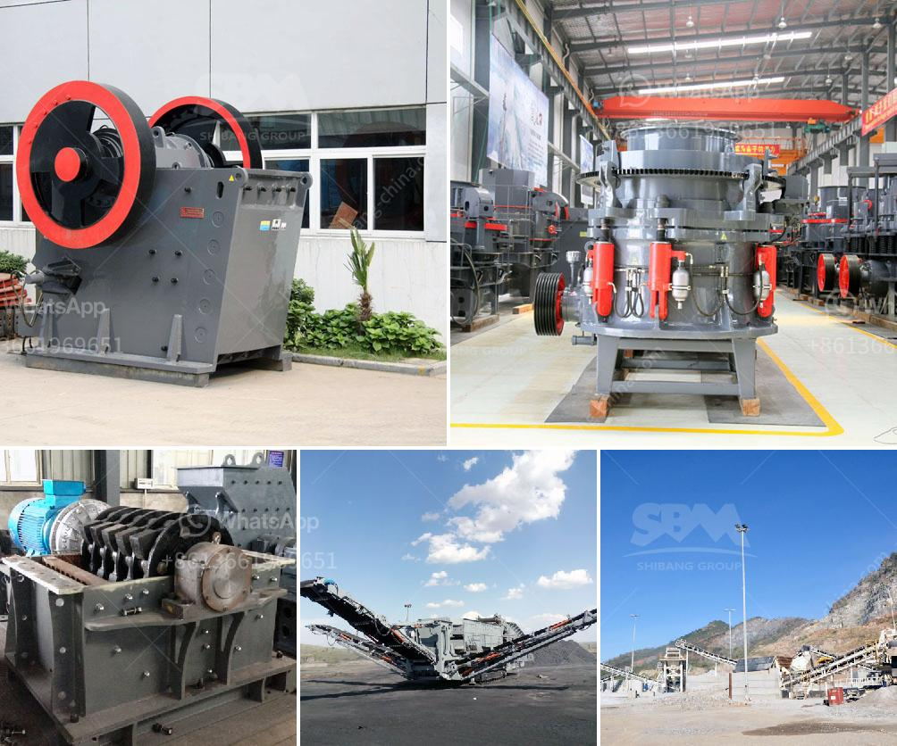

<h3>what is the cost of limestone crushing process</h3>
Limestone crushing is a specific and essential process in the mining industry, as it sets the stage for the subsequent steps in the crushing process. The cost of limestone crushing process entails many factors, including the investment, production cost, maintenance cost, manpower cost, and other miscellaneous costs. 

First and foremost, the cost of limestone crushing process heavily relies on the size and hardness of the limestone. The larger and harder the limestone, the more equipment and energy required to conduct the crushing process. This will increase the investment cost, as more sophisticated machinery and equipment will be needed to handle the larger and tougher limestone rocks.

Furthermore, the production cost of limestone crushing process is influenced by various operational factors. These include the efficiency and productivity of the crushing equipment, as well as the cost of maintaining and operating the machinery. Regular maintenance is crucial to ensure smooth operations and prevent breakdowns that can halt the entire crushing process and add additional costs for repairs.

The manpower cost is another significant aspect to consider in the overall cost of limestone crushing process. Adequate staff is required to operate and monitor the crushing equipment, as well as to handle the transportation and loading of the crushed limestone. Skilled and experienced workers are often required, which may add to the labor cost.

Lastly, there are miscellaneous costs that can contribute to the overall cost of limestone crushing process. These expenses include insurance, permits, royalties, taxes, and any other regulatory costs associated with mining and crushing activities. These miscellaneous costs may vary depending on the specific location and regulatory framework in which the crushing process takes place.

In conclusion, the cost of limestone crushing process can vary depending on various factors, including the size, hardness, and quantity of limestone, as well as the efficiency of the equipment, maintenance requirements, labor cost, and miscellaneous expenses. Proper planning and effective management of these factors are crucial to minimize costs and optimize the overall performance of the limestone crushing process.
<h3>Contact us</h3><ul><li><strong>Whatsapp:&nbsp;<a href="https://wa.me/8613661969651">+8613661969651</a></strong></li><li><a href="https://swt.shibang-china.com/?git&amp;zhl&amp;what is the cost of limestone crushing process"><strong>Online Service(chat now)</strong></a></li></ul><h3>Related</h3><ul><li><a href='crusher machine in pakistan.md'>crusher machine in pakistan</a></li><li><a href='prices for cement processing machines.md'>prices for cement processing machines</a></li><li><a href='stone crushing plant price list.md'>stone crushing plant price list</a></li><li><a href='price of crushing machine.md'>price of crushing machine</a></li><li><a href='graphite mine slurry ball mill.md'>graphite mine slurry ball mill</a></li></ul>