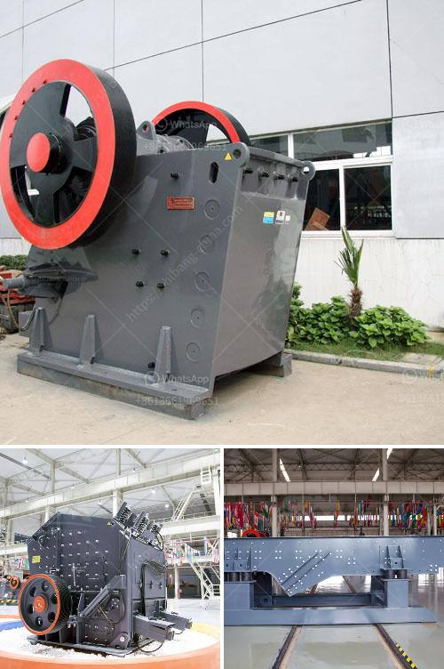

<h3>wiring circuit of grinding machine</h3>
The grinding machine is a widespread tool, commonly used in small workshops, garages, and industrial settings. This machine is used to grind metals or raw materials for further processing, such as polishing, sanding, or deburring. However, this powerful tool comes with its own set of risks, especially if not properly wired and powered.

When it comes to wiring the circuit of a grinding machine, safety should always be the top priority. An improperly wired machine can lead to electric shocks, fires, or even fatal accidents. Therefore, it is essential to understand the proper wiring steps and follow them accordingly.

Before starting the wiring process, it is crucial to gather all the necessary tools and materials. These may include electrical wires, wire connectors, a junction box, switches, and a power supply source. It is important to ensure that the power supply source matches the machine's voltage and amperage requirements to avoid overloading the electrical system.

The first step in wiring a grinding machine is determining the circuit requirements. It involves calculating the total load, which is the sum of all the electrical devices connected to the circuit. This step helps in determining the appropriate wire size and circuit breaker needed to handle the load safely.

Once the circuit requirements are determined, the next step is to plan the circuit layout. It is essential to choose the proper location for the switches, outlets, and the junction box to optimize accessibility and safety. Remember to keep the wiring away from moisture, excessive heat, and moving machine parts to prevent any damage or interference with the machine's operation.

After planning the circuit layout, it is time to start wiring the grinding machine. The first connection is made at the junction box. The wires coming from the power supply source should be connected to the corresponding terminals inside the box using wire connectors. These connectors ensure a secure and reliable electrical connection.

From the junction box, the wires are extended to the switch and outlet locations. It is crucial to install an appropriate switch that can handle the machine's load safely. A switch with a higher amperage rating than the machine's requirements is recommended to prevent overheating and other electrical faults.

Finally, the wires are connected to the outlet located near the grinding machine. The outlet should have matching voltage and amperage ratings as the machine to ensure a proper power supply. Secure wire connectors should be used to attach the wires to the outlet terminals, ensuring a tight and reliable connection.

After completing the wiring process, it is essential to double-check all the connections and make sure that all electrical components are properly grounded. Loose connections or inadequate grounding can lead to electrical faults, which can pose a considerable risk to the user and the machine.

In conclusion, wiring a grinding machine should always be done with the utmost care and attention to safety. Following the proper steps, calculating the circuit requirements, and using appropriate tools and materials are essential to ensure a safe and effective wiring installation. By taking the necessary precautions and following the correct procedures, the risk of accidents or electrical faults can be significantly reduced, allowing the grinding machine to function properly and efficiently.
<h3>Contact us</h3><ul><li><strong>Whatsapp:&nbsp;<a href="https://wa.me/8613661969651">+8613661969651</a></strong></li><li><a href="https://swt.shibang-china.com/?git&amp;zhl&amp;wiring circuit of grinding machine"><strong>Online Service(chat now)</strong></a></li></ul><h3>Related</h3><ul><li><a href='zinc ash crusher machine required.md'>zinc ash crusher machine required</a></li><li><a href='limestone crushing plant input and output size.md'>limestone crushing plant input and output size</a></li><li><a href='calcium carbonate production.md'>calcium carbonate production</a></li><li><a href='price hammer crusher nigeria.md'>price hammer crusher nigeria</a></li><li><a href='jual raymond mill bekas.md'>jual raymond mill bekas</a></li></ul>