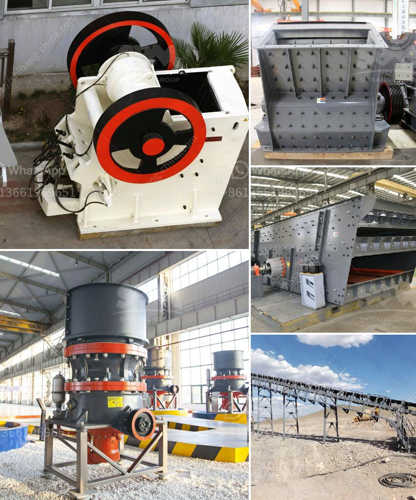

<h3>work principle of a hammer mill</h3>
The work principle of a hammer mill is based on a simple mechanism. However, before explaining how the whole process works, let's first take a look at some of the basics of a hammer mill.

A hammer mill is a machine used for grinding or shredding materials into smaller pieces. The basic design of this type of mill is a rotating shaft on which several hammers are attached. These hammers strike the material that is being fed into the machine, causing it to be reduced in size.

The main components of a hammer mill include a housing, rotor, and hammer. The housing is typically a steel drum, which contains the rotor and hammers. The rotor spins at a high speed inside the drum, while the hammers are attached to it. As the rotor spins, the hammers strike the material and gradually reduce its size.

The grinding or shredding process in a hammer mill is achieved by the repeated blows of the hammers against the material. These blows create enough force to break the material apart and reduce its size. The size reduction is usually achieved through a combination of impact and attrition forces.

When the material enters the hammer mill, it is fed through a feed inlet at the top of the housing. The material then falls onto the rotor and is struck by the rotating hammers. The impact force generated by the hammers breaks the material into smaller pieces.

The size of the final product can be controlled by adjusting the size of the openings in the screen located at the bottom of the housing. The smaller the screen openings, the finer the final product will be.

In addition to size reduction, a hammer mill can also be used for other purposes such as recycling, biomass processing, and waste management. For example, in the recycling industry, hammer mills are used to shred discarded materials for further processing.

One important aspect of the work principle of a hammer mill is the continuous flow of material from the feed inlet to the discharge outlet. This ensures a consistent and efficient grinding process. The hammer mill is designed to handle a wide range of materials, from soft to hard and from dry to wet.

In conclusion, the work principle of a hammer mill involves the repeated blows of hammers against the material, reducing it in size. The size reduction process is achieved through a combination of impact and attrition forces. A hammer mill is a versatile and useful machine that provides a reliable and efficient method of grinding and shredding materials.
<h3>Contact us</h3><ul><li><strong>Whatsapp:&nbsp;<a href="https://wa.me/8613661969651">+8613661969651</a></strong></li><li><a href="https://swt.shibang-china.com/?git&amp;zhl&amp;work principle of a hammer mill"><strong>Online Service(chat now)</strong></a></li></ul><h3>Related</h3><ul><li><a href='impact jaw crusher.md'>impact jaw crusher</a></li><li><a href='rock crusher machine price in india.md'>rock crusher machine price in india</a></li><li><a href='control plan for ball mill manufacturing.md'>control plan for ball mill manufacturing</a></li><li><a href='used gypsum crusher machine for sale in pakistan.md'>used gypsum crusher machine for sale in pakistan</a></li><li><a href='ball mill for starch damage.md'>ball mill for starch damage</a></li></ul>