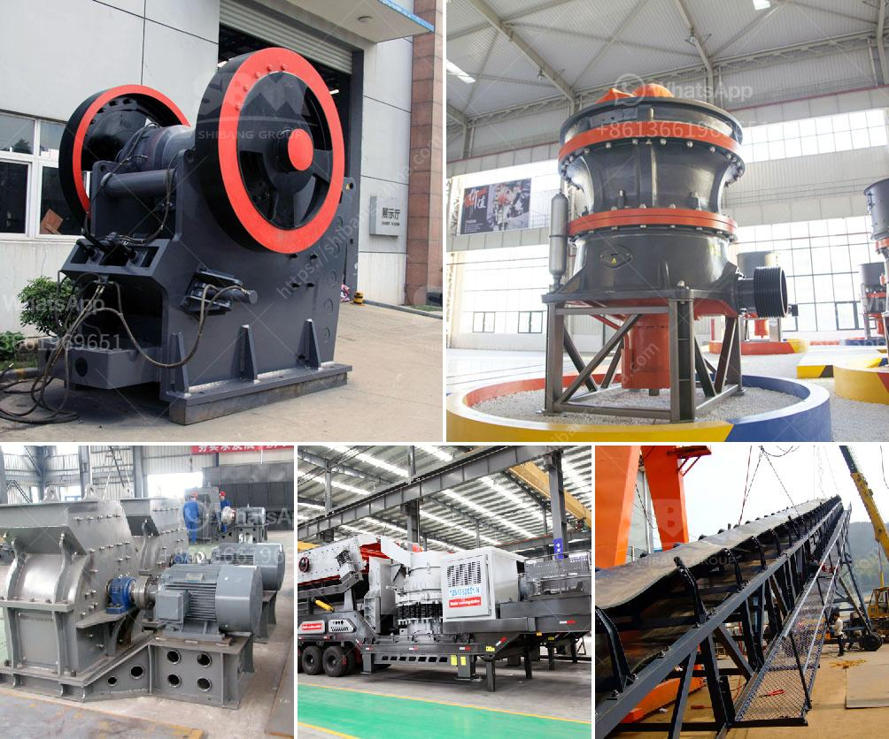

<h3>working of ball mill in hindi</h3>
बॉल मिल एक प्रकार का उच्च क्षमता वाला उपकरण है जिसे मिलिंग मशीन के रूप में उपयोग किया जाता है। इसे इस्तेमाल करके इलेक्ट्रोनिक और फ़ेरोसिलिकोन विज्ञान, खनिज, भूमिगत विज्ञान और कार्बन विज्ञान आदि में प्रयोगी उत्पादों को बनाया जाता है। बॉल मिल आमतौर पर धातु, कार्बाइड, सिलिकेट, नट, काला सांड, खदन की पत्थर, प्लास्टिक, केमिकल पदार्थ, सागरीय स्लेट की पत्थर, विउलेन तत्व आदि पीसने के उद्देश्य से उपयोग की जाती है।

बॉल मिल की मुख्य धारा संवेदनशीलता और नियंत्रित तरीके से होने का अवसर देने के लिए प्रयोग होती है। इसकी मुख्य प्रक्रिया चक्रीय किनेटिकी के तत्वों की हस्तक्षेप होती है जो प्रदान होते हैं द्वारा पोलियों के पट्टियों और गोल इलेक्ट्रोनिक कनेक्टरों के जरिए किए गए कार्यों में संपर्क और प्रभावित हो जाते हैं।

1. फ़ीडिंग कंपोंट जो इंगोट्स को टैंगंग करने और बहुत छोटे कणों पर तोड़ने के लिए प्रयोग किया जाता है।

2. रोटेटरी पीस्पर किसी भी आवश्यक आयाम और त्वचा के साथ निश्चित आकार का उठा लेता है। यह किसी विशिष्ट लक्ष्य के लिए पीसने की प्रक्रिया को नियंत्रित करने में मदद करता है।

3. एक डिशलचक्री कवर बॉल मिल को इस्तेमाल करने के लिए और उसे मज़बूत बनाने के लिए होता है। यह बॉल मिल के उदघाटन में सुरक्षा प्रदान करता है और इसकी परिधि को लचीले तत्वों के साथ प्रतिरोधी बनाता है।

जब बॉल मिल सक्रिय होता है, तो फ़ीडिंग कंपोंट द्वारा दाले गए मदों को रोटेटरी पिस्पर में रखा जाता है। यहां, मेटल बॉल पर्याय रूप से पीसण के लिए प्रयुक्त होते हैं। रोटेटरी पिस्पर का हिस्सा घूरता रहता है और मेटल बॉल के साथ पड़ने की गति में उनसे संपर्क करता है जो मदों को कुचल कर छोटे टुकड़ों में विभाजित कर देता है। ध्यान देने योग्य बात यह है कि इस प्रक्रिया में मदों के मूल्यांकन के लिए अपने निर्देशित खाका चयन को रखा जाता है या वहीं किया जाता है।

बॉल मिल में कई प्रकार की बॉल्स का उपयोग किया जाता है जैसे की हाइ क्रोम बॉल्स, मंगनीज़ बॉल्स, आदि जो प्रतिसाद के काम के लिए सबसे उपयुक्त हो सकती हैं। इसके आलावा पूर्व-पुत्री, प्रोन्ग रूपांतरण और शक्तिशाली चक्री-आत्म संचालन तत्व बाजार और उपयोगकर्ताओं को उपलब्ध होते हैं। इसलिए, बॉल मिल बड़े पैमाने पर खदानों, मिट्टी और सागर में निर्मित उत्पादों की निर्माण, संशोधन और उत्पन्न करने के लिए आवश्यक है।

इस प्रकार, बॉल मिल एक आवश्यक खनन उपकरण है जिसे औद्योगिक और वैज्ञानिक क्षेत्रों में प्रयोग किया जाता है। इसकी मदद से उच्च गुणवत्ता वाले उत्पादों का निर्माण करना संभव होता है जो विभिन्न उद्देश्यों को पूरा करने में मदद करते हैं। इसलिए, इसका व्यापक प्रयोग सुनिश्चित करें और सुरक्षित बनाए रखें ताकि उत्पादन प्रक्रिया में कोई संकट न हो।
<h3>Contact us</h3><ul><li><strong>Whatsapp:&nbsp;<a href="https://wa.me/8613661969651">+8613661969651</a></strong></li><li><a href="https://swt.shibang-china.com/?git&amp;zhl&amp;working of ball mill in hindi"><strong>Online Service(chat now)</strong></a></li></ul><h3>Related</h3><ul><li><a href='cement cement grinding ball mill.md'>cement cement grinding ball mill</a></li><li><a href='how to grind stone into fine powder.md'>how to grind stone into fine powder</a></li><li><a href='for sale stone crusher in sri lanka.md'>for sale stone crusher in sri lanka</a></li><li><a href='ball mills for mining technical drawing.md'>ball mills for mining technical drawing</a></li><li><a href='crusher for sale 120 ton.md'>crusher for sale 120 ton</a></li></ul>