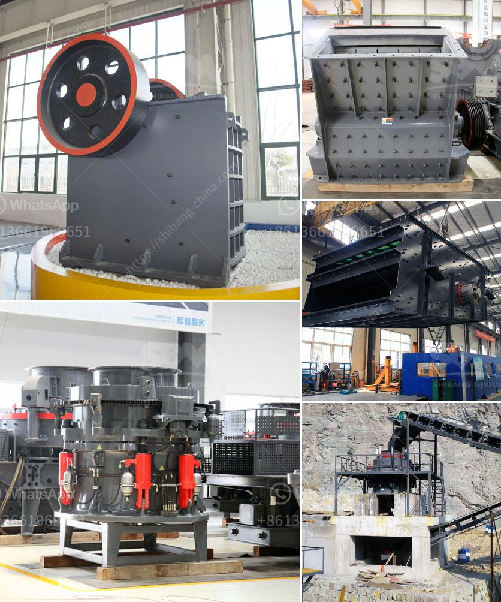

<h3>zinc ash crusher machine required</h3>
Zinc ash is a byproduct of the galvanizing process, which involves coating steel or iron objects with a protective layer of zinc. Zinc ash is typically composed of metallic zinc particles and zinc oxide. It is usually collected in dust collection systems, such as baghouses, and needs to be properly disposed of due to its hazardous nature.

To effectively manage zinc ash and ensure its safe disposal, a zinc ash crusher machine is often required. This machine is used to crush zinc ash into small particles, making it easier to handle and transport. The machine works by reducing the ash particles to a size suitable for further processing or disposal.

One important feature of a zinc ash crusher machine is its ability to prevent the formation of dust during the crushing process. Dust can pose a significant health and safety risk, especially when dealing with hazardous materials like zinc ash. A good crusher machine will have a dust extraction system in place to remove and collect any dust generated during crushing, ensuring a safe working environment.

Another key aspect to consider when choosing a zinc ash crusher machine is its capacity. Depending on the volume of zinc ash generated by a particular operation, the machine's capacity should be able to handle the required workload. It is advisable to select a machine with a higher capacity than what is currently needed to allow for any future increases in zinc ash production.

Additionally, the construction material of the machine should be corrosion-resistant to withstand the corrosive nature of zinc ash. Zinc ash can react with moisture in the air, causing corrosion and potentially compromising the machine's structural integrity. A well-built machine with suitable materials will ensure its durability and longevity.

The size and design of the zinc ash crusher machine also play a significant role in its efficiency. A compact and user-friendly design will allow for easy operation and maintenance. The machine should have accessible components for quick inspection and cleaning, reducing downtime and optimizing productivity.

When considering a zinc ash crusher machine, it is vital to choose a reputable manufacturer or supplier. Look for companies with a track record of delivering high-quality machinery that meets industry standards and regulations. Reading customer reviews and seeking recommendations from industry professionals can help in making an informed decision.

In conclusion, a zinc ash crusher machine is an essential tool in managing and disposing of zinc ash generated during the galvanizing process. It allows for efficient crushing, ensuring the safe handling and transport of the hazardous material. When selecting a machine, factors such as dust prevention, capacity, corrosion resistance, and design should be considered. Investing in a reliable and well-designed crusher machine will improve operational efficiency and promote a safe working environment.
<h3>Contact us</h3><ul><li><strong>Whatsapp:&nbsp;<a href="https://wa.me/8613661969651">+8613661969651</a></strong></li><li><a href="https://swt.shibang-china.com/?git&amp;zhl&amp;zinc ash crusher machine required"><strong>Online Service(chat now)</strong></a></li></ul><h3>Related</h3><ul><li><a href='suppliers of ball mill in bhopal.md'>suppliers of ball mill in bhopal</a></li><li><a href='concrete breakers for sale in south africa.md'>concrete breakers for sale in south africa</a></li><li><a href='list of quarry crusher company in the philippines.md'>list of quarry crusher company in the philippines</a></li><li><a href='fly ash introduction in cement ball mill.md'>fly ash introduction in cement ball mill</a></li><li><a href='hot sale and low cost mobile crushing plant.md'>hot sale and low cost mobile crushing plant</a></li></ul>